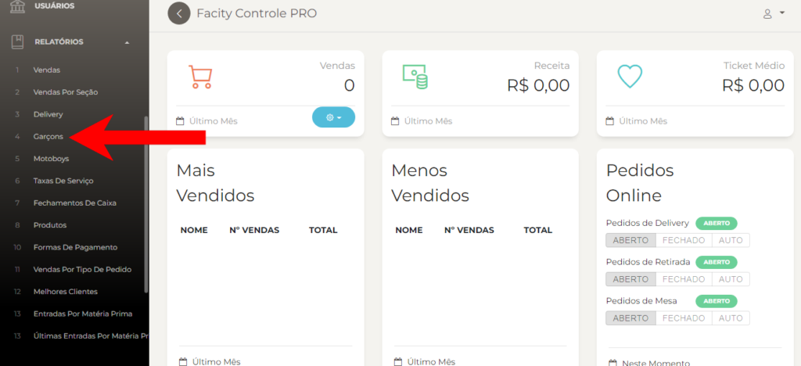
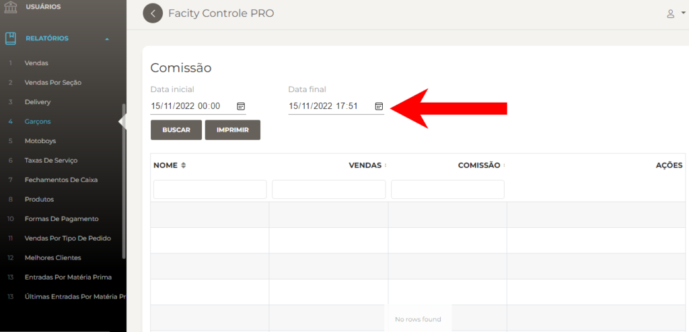

Neste post, vamos te ensinar a gerar relatórios de comissão/garçom utilizando o **Facity Controle**. Confira abaixo o passo a passo:

**Passo 1:** Abra o **Facity Controle** em seu computador

Acesse o programa **Facity Controle** em seu computador e insira o **nome da empresa**, **login** e **senha**. Lembre-se que tudo deve ser digitado em _letras minúsculas_.

**Passo 2:** Clique em **RELATÓRIOS** no menu lateral a esquerda

Após acessar o programa, clique na opção **"Relatórios"** no menu lateral à esquerda da tela.

**Passo 3:** Clique em **GARÇOM**

Na tela de relatórios, escolha a opção **"Garçom"**.

**Passo 4:** Escolha uma **data inicial** e uma **data final**

Informe a data inicial e a data final do período que deseja gerar o relatório. É importante lembrar que o filtro de datas só pode ser feito para um período de 30 dias.

**Passo 5:** Busque pelo nome na barra de pesquisa

Caso queira filtrar o relatório pelo **nome do garçom**, você pode digitar o nome desejado na barra de pesquisa.

**Passo 6:** Clique em **BUSCAR** para gerar relatório de comissão/garçom

Após inserir todas as informações necessárias, clique em **"Buscar"** para gerar o relatório de comissão/garçom.

Pronto! Agora você sabe como gerar relatórios de comissão/garçom utilizando o **Facity Controle**. Com essas informações, você pode ter um controle mais eficiente sobre as comissões dos seus funcionários.
