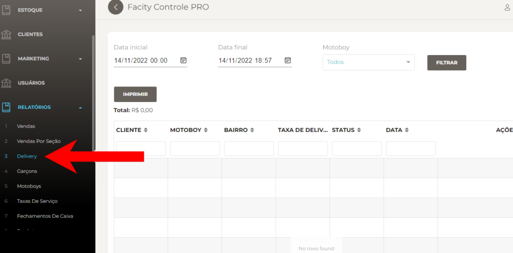
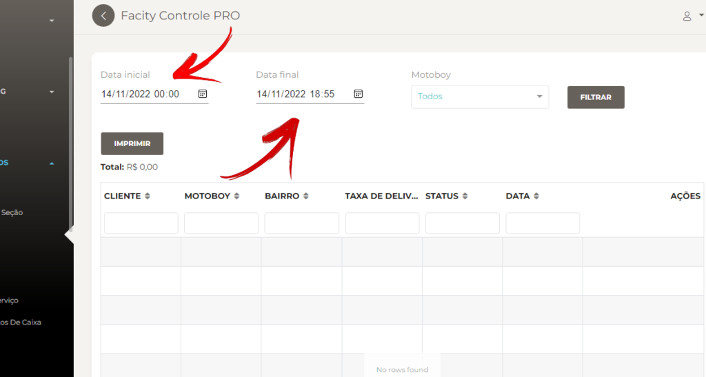
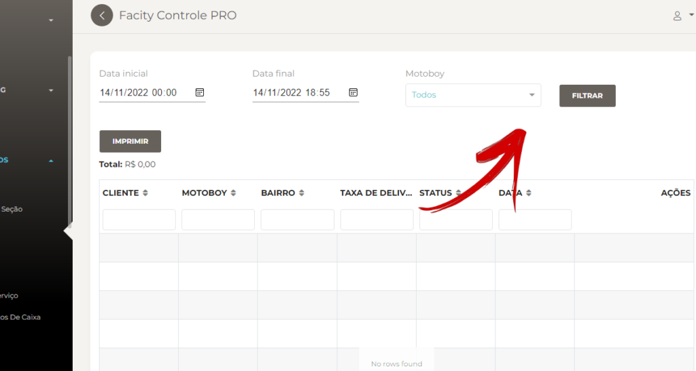

Como gerar relatórios de **delivery:** um guia passo a passo

**Passo 1:** Abra o Facity Controle em seu computador

A primeira coisa que você precisa fazer é acessar o **Facity Controle** em seu computador. Esse é o software que você usará para gerar seus relatórios. Certifique-se de ter o **nome da empresa**, **login** e **senha** em mãos. É importante lembrar que todas as informações devem ser inseridas em _letras minúsculas_.

**Passo 2:** Acesse **"Relatórios**".

Depois de fazer login, clique na opção **"Relatórios"** no menu lateral esquerdo. Em seguida, clique na opção **"Delivery"**.

**Passo 3:** Defina um período de tempo para o relatório

Agora é hora de selecionar um período de tempo para o seu relatório. Escolha uma **data inicial** e uma **data final**. É importante lembrar que só é possível filtrar datas em um período de 30 dias entre cada uma. Se você quiser uma busca mais específica, pode usar a barra de pesquisa para procurar por nomes de clientes.

**Passo 4:** Selecione o motoboy

Na seção **"MOTOBOY"** (Entregador), você pode selecionar um ou todos os seus entregadores. Isso permitirá que você obtenha uma visão geral do desempenho de cada um.

**Passo 5:** Clique em **"Filtrar"** para gerar o relatório

Depois de selecionar as datas e o entregador, clique no botão **"Filtrar"** para gerar o relatório.

Seguindo os passos acima, você pode obter informações sobre o desempenho de sua equipe e tomar decisões informadas para melhorar seus resultados.
