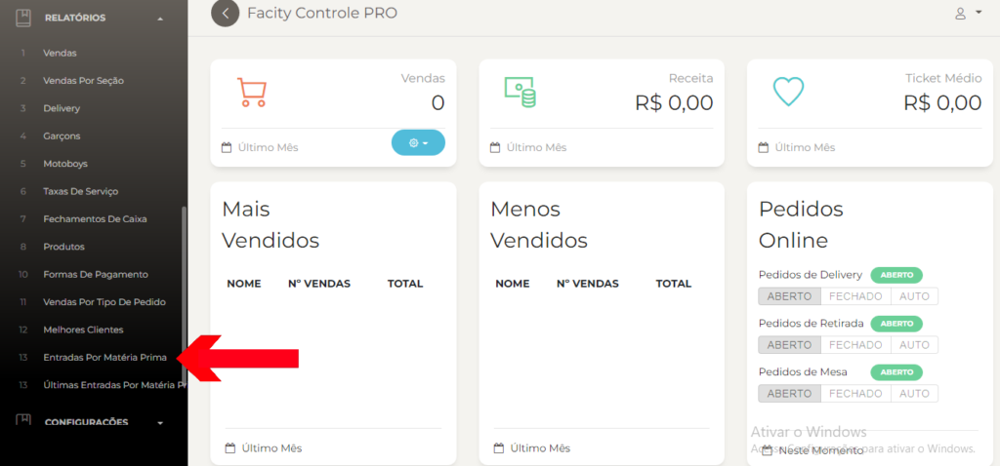
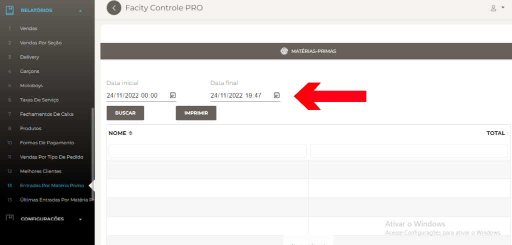

Passo a passo para gerar relatórios de entradas por matéria prima no Facity Controle:

**Passo 1:** Abra o **Facity Controle** no seu computador.

Insira o **nome da empresa**, **login** e **senha**, tudo em _letras minúsculas._

**Passo 2:** Clique em **"Relatórios"** no menu lateral esquerdo.

**Passo 3:** Selecione **"Entradas por Matéria Prima"**.

**Passo 4:** Escolha uma data inicial e uma data final para o período que deseja filtrar.

Lembre-se que o intervalo máximo permitido é de 30 dias

**Passo 5:** Clique em **"Buscar"** para gerar o relatório de entradas por matéria prima.

Nesse relatório, você poderá ver informações sobre as **entradas de matéria prima** na sua empresa. Essas informações são essenciais para o controle de estoque e para garantir uma gestão eficiente do seu negócio.

Espero que esse passo a passo tenha sido útil e que você consiga gerar seus relatórios com facilidade!
