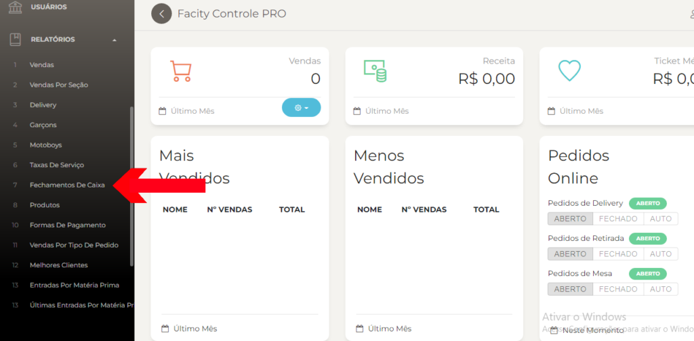
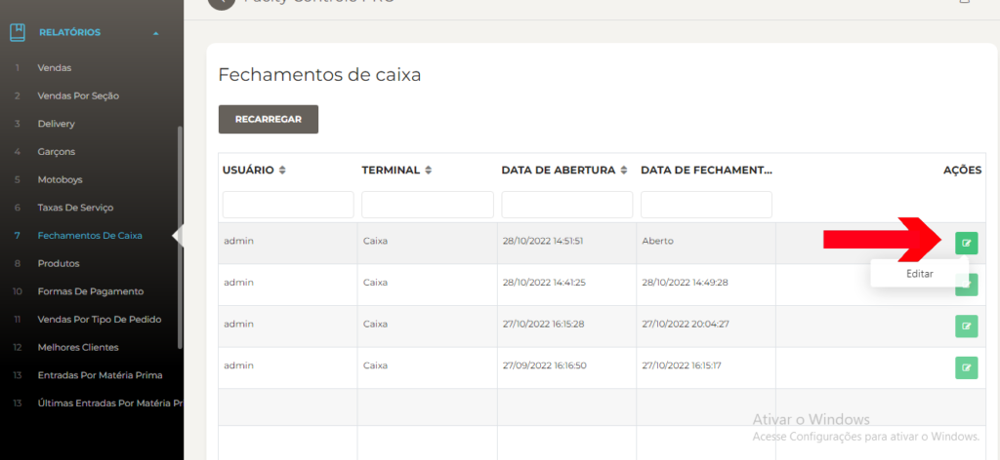
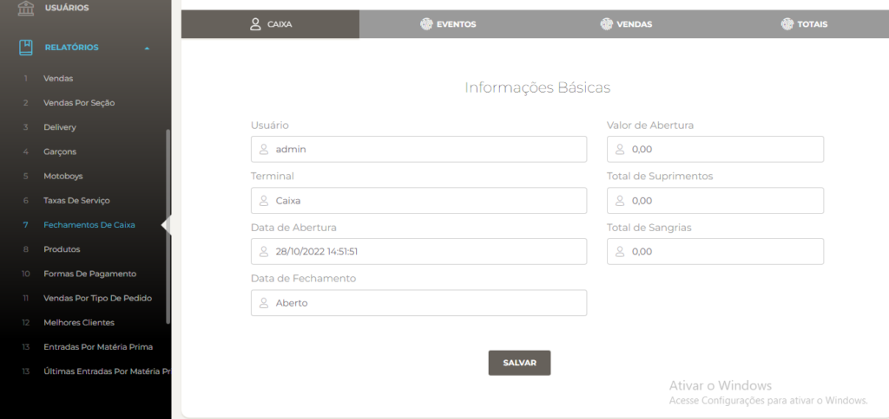
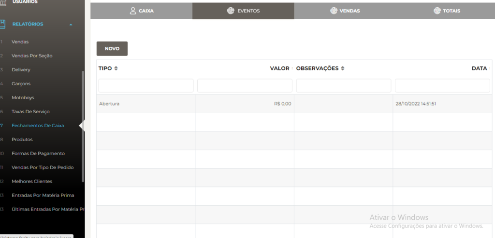
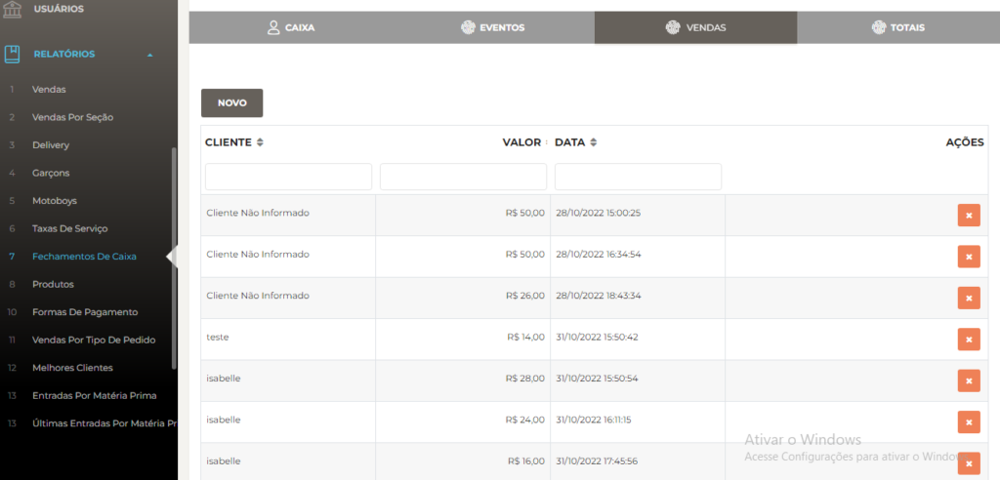
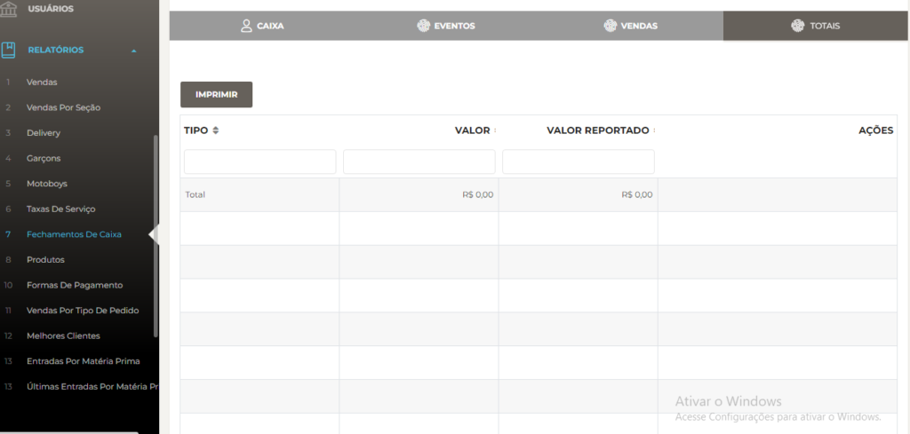

Gerar relatórios de fechamento de caixa é uma tarefa essencial para o controle financeiro da sua empresa. Com esses relatórios, você pode ter uma visão clara das vendas realizadas em um determinado período, além de conferir se as movimentações de caixa estão de acordo com as vendas realizadas. Neste artigo, vamos ensinar um passo a passo simples para gerar relatórios de fechamento de caixa no **Facity Controle**.

**Passo 1:** Acesse o **Facity Controle**

Abra o **Facity Controle** no seu computador e faça o **login com o nome da empresa**, **nome do usuário** e **senha** em _letras minúsculas_.

**Passo 2:** Acesse a opção **"Relatórios"**

No menu lateral à esquerda, clique em **"Relatórios"**.

**Passo 3:** Selecione **"Fechamentos de Caixa"**

Dentro dos relatórios, escolha a opção **"Fechamentos de Caixa"**.

**Passo 4:** Acesse as informações

Clique no _ícone verde_ para acessar as informações do fechamento de caixa ou editar as informações, caso seja necessário.

**Passo 5:** Verifique as informações do fechamento de caixa

Nessa tela, você poderá conferir a **abertura** e o **fechamento de caixa**, bem como todas as **vendas** realizadas por cliente.

**Passo 6:** Verifique os totais e imprima o relatório

Ao final da tela, estarão os totais das vendas e a opção de imprimir o relatório.

Seguindo esses passos, você poderá gerar relatórios de fechamento de caixa de forma simples e rápida, o que ajudará a manter o controle financeiro da sua empresa em dia.
