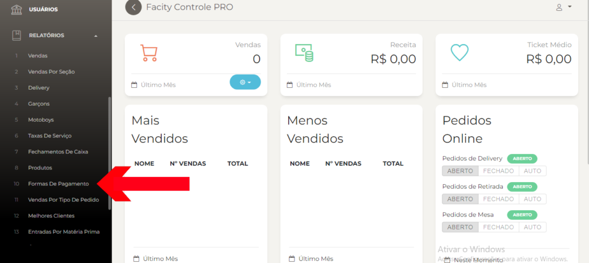
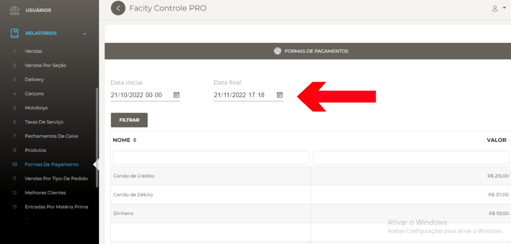

Como gerar relatórios de formas de pagamento no **Facity Controle**

Se você quer saber como está o desempenho das formas de pagamento em seu estabelecimento, gerar um relatório é a melhor opção. Com o **Facity Controle**, você pode fazer isso de forma simples e rápida. Confira o passo a passo:

**Passo 1:** Abra o **Facity Controle** em seu computador

Certifique-se de que o programa esteja instalado em seu computador e tenha o **nome da empresa**, **login** e **senha** em mãos. Lembre-se de que tudo deve ser em _letras minúsculas_.

**Passo 2:** Acesse a opção **RELATÓRIOS** no menu lateral esquerdo

Após fazer login, você será direcionado para a página inicial do **Facity Controle**. No menu lateral à esquerda, clique em **"Relatórios"**.

**Passo 3:** Selecione a opção **FORMAS DE PAGAMENTO**

Entre as opções de relatórios disponíveis, selecione **"Formas de Pagamento"**.

**Passo 4:** Escolha a data inicial e a data final

Na página de **"Formas de Pagamento"**, escolha a data inicial e a data final que deseja analisar. É importante lembrar que esse filtro só pode ser feito em um período de 30 dias entre cada data.

**Passo 5:** Clique em **FILTRAR** para gerar o relatório de formas de pagamento

Com tudo preenchido, basta clicar em **"Filtrar"** para gerar o relatório completo das formas de pagamento utilizadas em seu estabelecimento no período selecionado.

Imediatamente! Agora você já sabe como gerar relatórios de formas de pagamento no **Facity Controle**. Fácil, não é mesmo? Experimente e descubra como essa ferramenta pode ajudar a melhorar a gestão do seu negócio.
