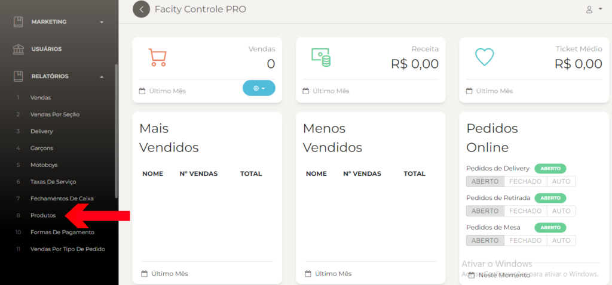
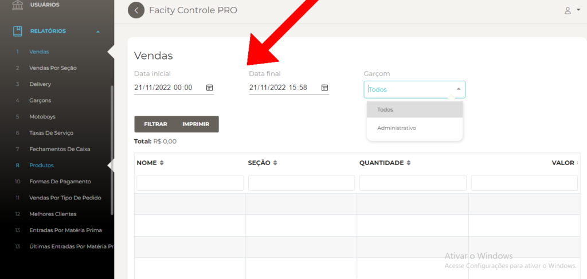

Passo a passo para gerar relatórios de venda de produtos:

**Passo 1:** Abra o **Facity Controle** no seu computador.

**Passo 2:** Insira o **nome da empresa**, **login** e **senha**. Verifique se as informações estão em _letras minúsculas_.

**Passo 3:** Clique em **"Relatórios"** no menu lateral à esquerda.

**Passo 4:** Selecione a opção **"Produtos"**.

**Passo 5:** Escolha uma data inicial e uma data final para o período de vendas que você deseja analisar. Lembre-se que só é possível filtrar um período de 30 dias entre cada data.

**Passo 6:** Você pode selecionar o nome do garçom responsável pelas vendas ou deixar como **"todos"**.

**Passo 7:** Clique em **"Filtrar"** para gerar o relatório de vendas de produtos.

Pronto! Agora você pode analisar as informações e dados de vendas de produtos da sua empresa.
