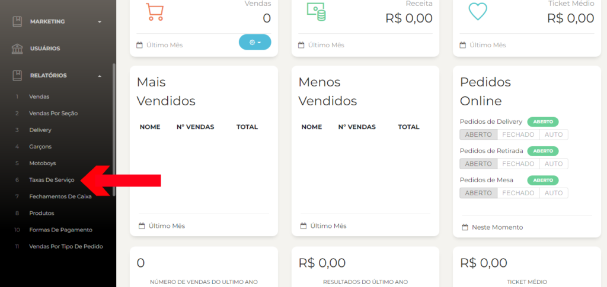
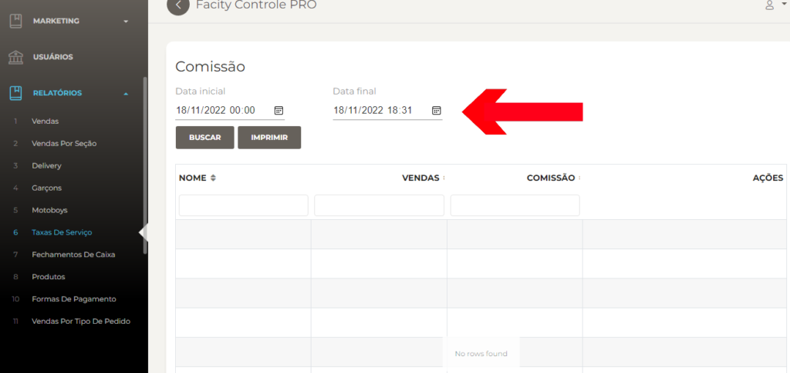

passo a passo sobre como gerar relatórios de taxas de serviço no **Facity Controle**:

**Passo 1:** Abra o Facity Controle em seu computador.

**Passo 2:** Insira o **nome da empresa**, **login** e **senha**, certificando-se de que todas as informações estão em _letras minúsculas_.

**Passo 3:** No menu lateral esquerdo, clique em **"Relatórios"**.

**Passo 4:** Selecione a opção **"Taxas de Serviço"**.

**Passo 5:** Escolha uma data inicial e uma data final para o período que você deseja analisar.

Lembre-se de que o período de tempo não pode ser superior a 30 dias.

**Passo 6:** Clique em **"Buscar"** para gerar o relatório de taxas de serviço.

Pronto! Agora você pode visualizar o relatório de taxas de serviço da sua empresa.
