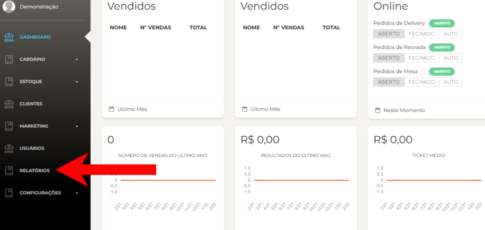
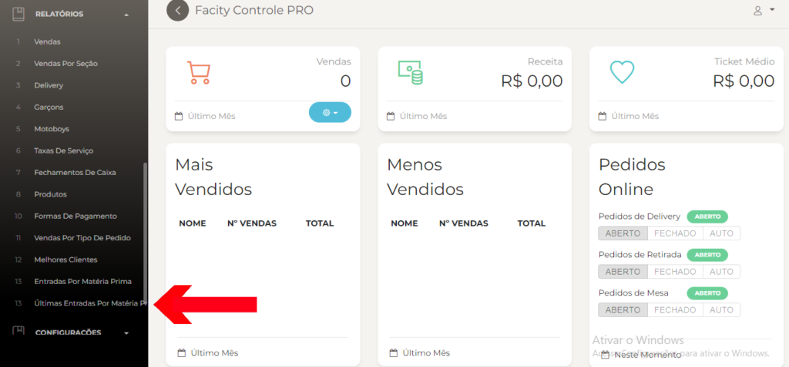
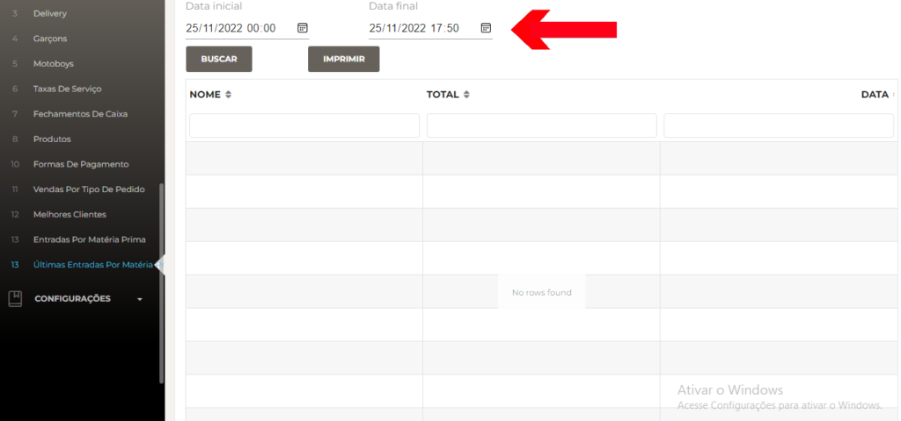

Segue abaixo um passo a passo sobre como gerar relatórios de últimas entradas por matéria prima no **Facity Controle:**

**Passo 1:** Abra o **Facity Controle** em seu computador

Para gerar o relatório de últimas entradas por matéria prima, é necessário acessar o **Facity Controle** em seu computador. Certifique-se de que está conectado à internet e abra o programa.

**Passo 2:** Insira os dados de **login da empresa**

Após abrir o programa, insira o **nome da empresa**, **login** e **senha** nos campos indicados. Lembre-se de digitar tudo em _letras minúsculas_.

**Passo 3:** Clique em **"Relatórios"** no menu lateral

No menu lateral esquerdo, clique na opção **"Relatórios"**. Em seguida, selecione a opção **"Últimas entradas por matéria prima"**.

**Passo 4:** Escolha as datas de filtro

Ao selecionar a opção **"Últimas entradas por matéria prima"**, você será redirecionado para uma nova página. Nela, escolha uma data inicial e uma data final para filtrar as entradas de matéria prima. É importante lembrar que o período entre as datas escolhidas não pode ser maior do que 30 dias.

**Passo 5:** Clique em **"Buscar"**

Após selecionar as datas desejadas, clique em **"Buscar"** para gerar o relatório de últimas entradas por matéria prima.

Pronto! Agora você já sabe como gerar relatórios de últimas entradas por matéria prima no **Facity Controle**. Se tiver alguma dúvida, deixe um comentário abaixo que eu te ajudo.
