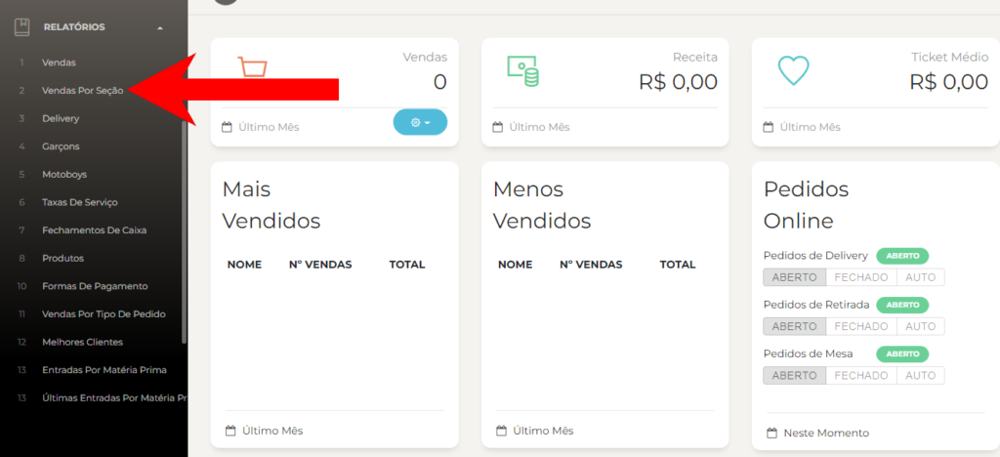
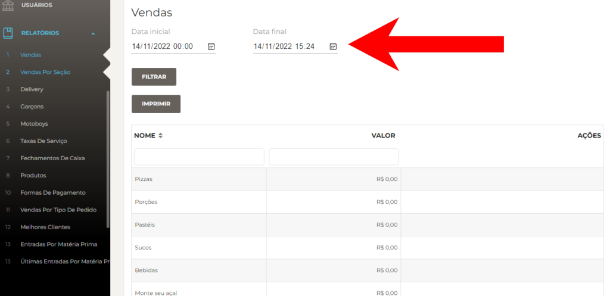
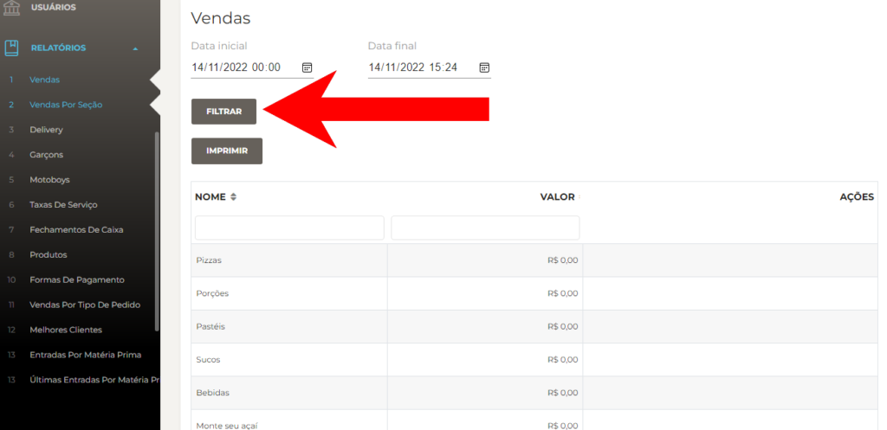
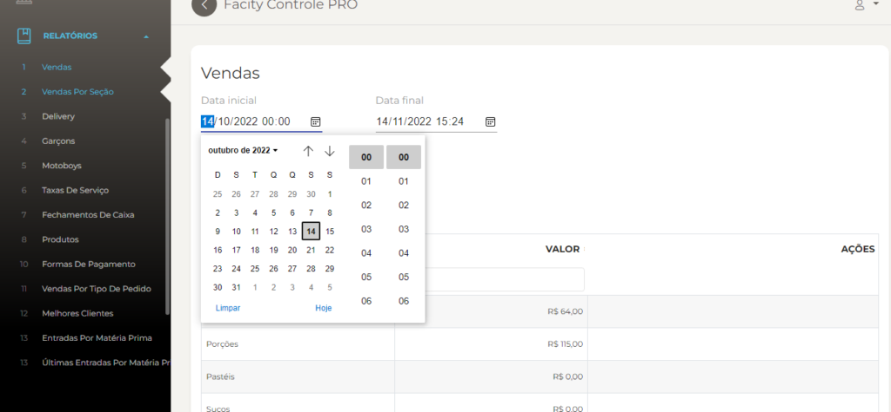
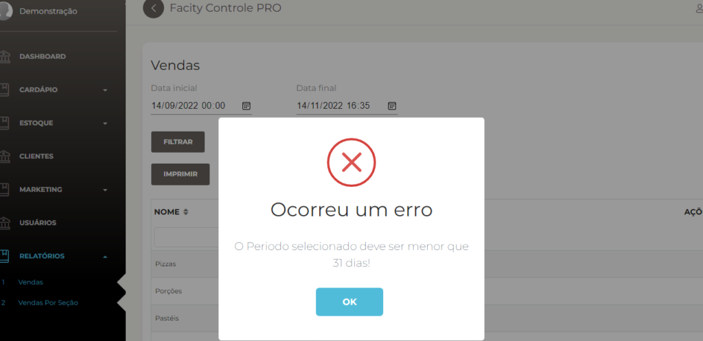

Neste tutorial, vou ensinar como gerar relatórios de vendas por seção usando o Facity Controle. Siga as instruções passo a passo abaixo:

**Passo 1:** Abra o **Facity Controle** em seu computador

Certifique-se de inserir o **nome da empresa**, **login** e **senha**. Lembre-se de que todas as letras devem estar em _minúsculo_.

**Passo 2:** Clique em **"RELATÓRIOS**" no menu lateral esquerdo

Ao fazer isso, uma lista de opções de relatórios será exibida.

**Passo 3:** Selecione **"VENDAS POR SEÇÃO"**

Isso permitirá que você gere relatórios de vendas de cada seção.

**Passo 4:** Escolha uma **data inicial** e **final.**

Defina um período de tempo para o qual você deseja gerar relatórios de vendas. Você pode escolher uma data específica ou um intervalo de datas.

**Passo 5:** Clique em **"FILTRAR"** para iniciar a busca

Ao fazer isso, o software procurará por todas as vendas dentro do período de tempo selecionado.

**Passo 6:** Filtrar por seção

Se você deseja gerar um relatório de vendas para uma seção específica, digite o nome da seção no campo de busca e clique em **"FILTRAR"**. Isso mostrará apenas as vendas da seção escolhida.

**Observação importante:** O período de tempo entre as datas de pesquisa deve ser inferior a 30 dias. Se for superior a 30 dias, o software não exibirá nenhum resultado.

_Exemplo na imagem se a data passar de um período de 30 dias_:

Seguindo esses simples passos, você pode gerar facilmente relatórios de vendas por seção usando o Facity Controle.
