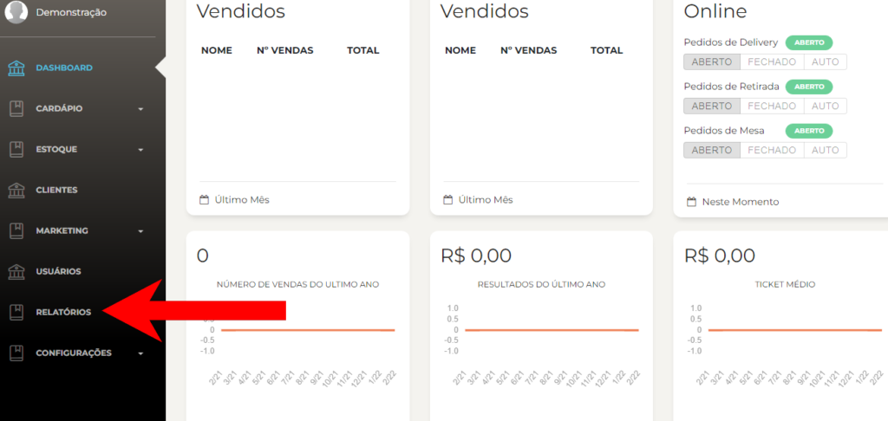
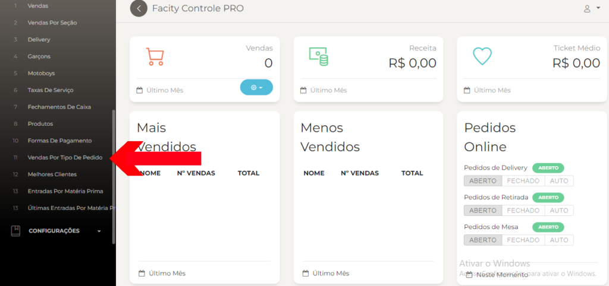
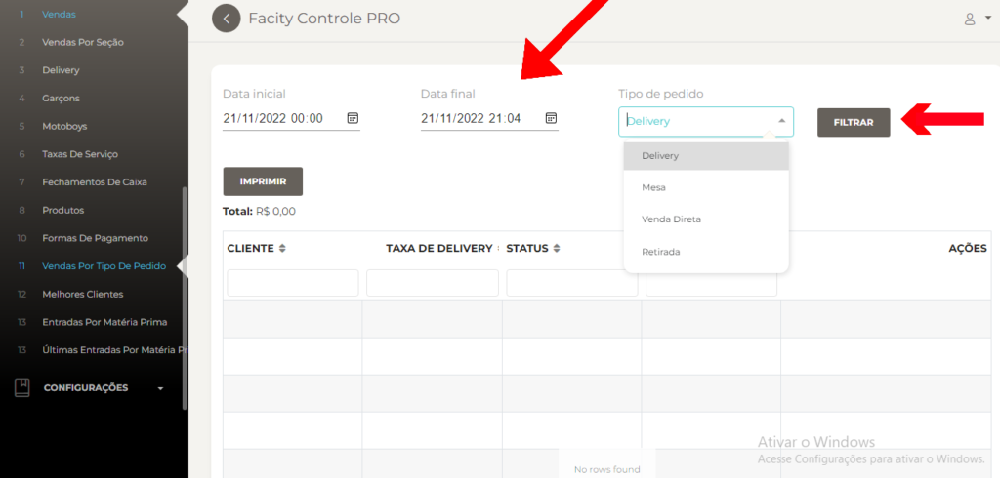

Neste post, vamos mostrar como você pode gerar esses relatórios usando o **Facity Controle**.

**Passo 1:** Abra o **Facity Controle** em seu computador

O primeiro passo é abrir o **Facity Controle** em seu computador. Certifique-se de ter o programa instalado e que você tenha o **nome da empresa**, **login** e **senha para acessar**. Lembrando que é tudo em _letras minúsculas_.

**Passo 2:** Clique em **RELATÓRIOS** no menu lateral a esquerda

Após fazer login, você será direcionado para a página inicial do Facity Controle. No menu lateral à esquerda, clique em **"Relatórios"**.

**Passo 3:** Clique em **VENDAS POR TIPO DE PEDIDO**

Depois de clicar em **"Relatórios"**, você verá uma lista de opções. Selecione **"Vendas por Tipo de Pedido"**.

**Passo 4:** Escolha uma **data inicial** e uma **data final**

Na página de **"Vendas por Tipo de Pedido"**, escolha uma data inicial e uma data final. Lembre-se de que essas datas só podem ser filtradas em um período de 30 dias entre cada uma.

**Passo 5:** Escolha o tipo de pedido Escolha o tipo de pedido que você deseja analisar. Você pode escolher entre **"Delivery"**, **"Mesa"**, **"Venda Direta"** ou **"Retirada"**.

**Passo 6:** Clique em **FILTRAR** para gerar o relatório de vendas por tipo de pedido

Com esses passos simples, você pode gerar relatórios de vendas por tipo de pedido no **Facity Controle**.
