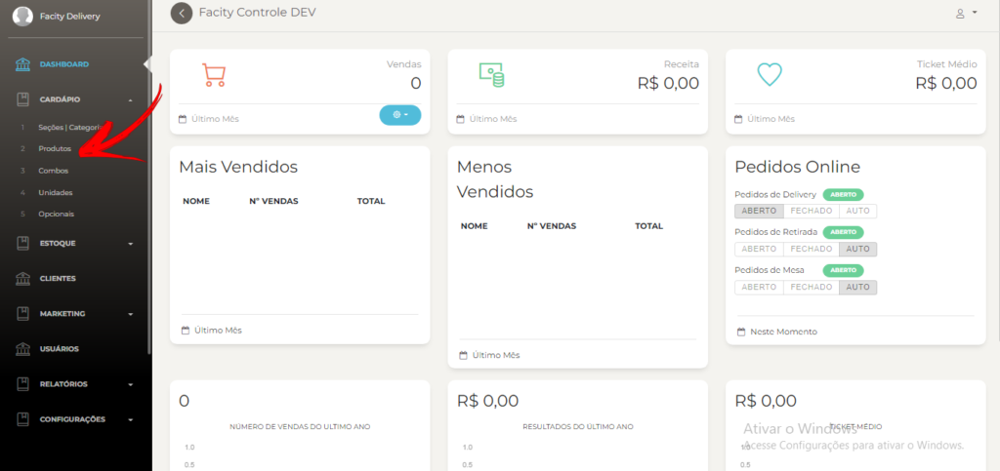
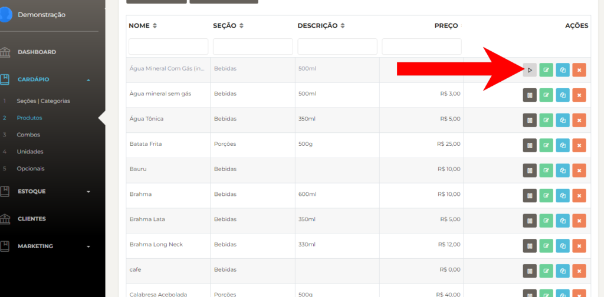
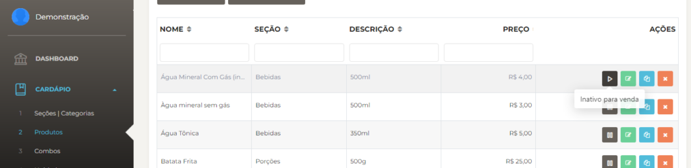

Inativar um produto no **Facity Controle** é um processo simples e rápido. Seguindo os passos abaixo:

**Passo 1:** Abra o **Facity Controle** em seu computador

Para inativar um produto no **Facity Controle**, é preciso ter acesso ao sistema em seu computador. Lembrando de colocar **nome da empresa**, **login** e **senha**, tudo em letras _minúsculas_.

**Passo 2:** Entre na seção de **Produtos**

Depois de fazer **login** com seu **nome de usuário** e **senha**, você será direcionado para a tela inicial do Facity Controle. Nela, você deve clicar na opção **"Produtos"** no menu principal para ter acesso aos produtos cadastrados em sua empresa.

**Passo 3:** Selecione o produto para ser **inativado/pausado**

Uma vez dentro da seção de Produtos, escolha o produto que deseja inativar. Para fazer isso, você pode buscar pelo nome do produto ou rolar a lista de produtos até encontrar o que procura.

- Clique nesse **ícone** como mostra a imagem abaixo para inativar um produto
- Para deixá-lo **ativo** de novo é só clicar novamente em cima

**Passo 4:** Inative o produto

Para inativar um produto, basta clicar no ícone indicado na imagem abaixo. Esse ícone se encontra ao lado direito do nome do produto e representa a opção de inativar o produto.

**Passo 5:** Reative o produto

Se precisar reativar o produto no futuro, basta clicar novamente no mesmo ícone e o produto voltará a ficar disponível para venda.

Inativar um produto no **Facity Controle** é simples e rápido. Com os passos descritos acima, você pode pausar ou reativar um produto a qualquer momento, sem dificuldades.
