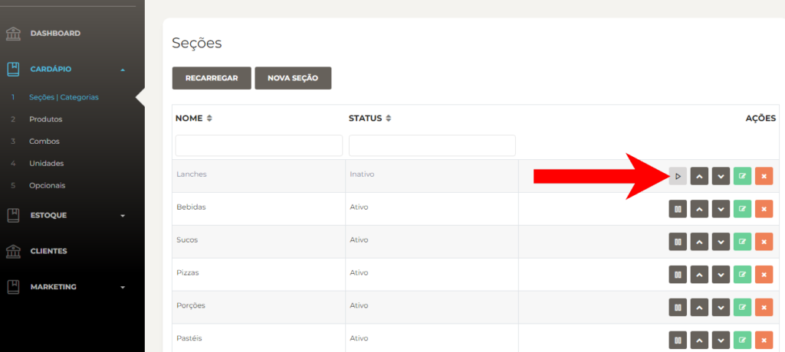
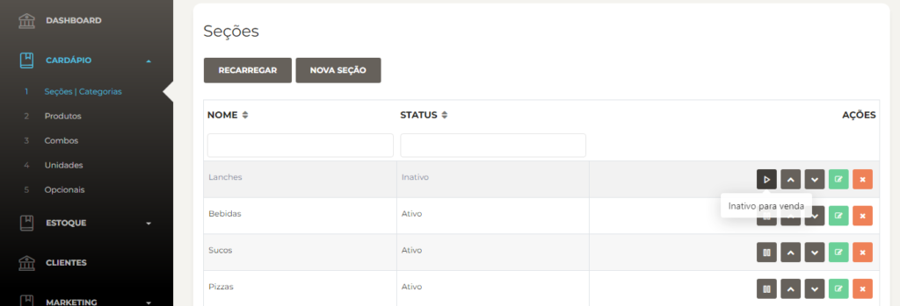

Inativar uma seção ou categoria pode ser útil caso você queira ocultar temporariamente um conjunto de produtos ou uma categoria específica. Veja abaixo como realizar esse processo de forma simples e rápida no **Facity Controle**.

**Passo 1:** Abra o **Facity Controle** em seu computador

Acesse o **Facity Controle** em seu computador e insira o **nome da empresa**, **login** e **senha**. Lembre-se de digitar tudo em _letras minúsculas_.

**Passo 2:** Acesse o menu de **seções/categorias**

No menu principal, procure pela opção **"Seções/Categorias"**. Clique nessa opção para acessar a lista de seções e categorias cadastradas.

**Passo 3:** Selecione a **seção/categoria** a ser inativada

Escolha a seção ou categoria que deseja inativar e clique sobre ela para selecioná-la.

**Passo 4:** Inative a **seção/categoria**

Para inativar a seção ou categoria, basta clicar no ícone correspondente, que se parece com uma seta, conforme indicado na imagem abaixo. O status da seção ou categoria mudará para "inativo".

**Passo 5:** Ative a **seção/categoria** novamente (se necessário)

Se precisar reativar a seção ou categoria novamente, basta clicar no mesmo ícone para alternar o status para "ativo".

Ao inativar uma seção ou categoria, você pode ver uma mensagem de confirmação ao aproximar o cursor do mouse sobre o ícone de inativar. Essa mensagem indicará que a **seção/categoria** foi inativada com sucesso.

Pronto! Agora você sabe como inativar uma seção ou categoria em sua loja pelo **Facity Controle**. Essa é uma maneira fácil e útil de gerenciar sua loja e seus produtos.
