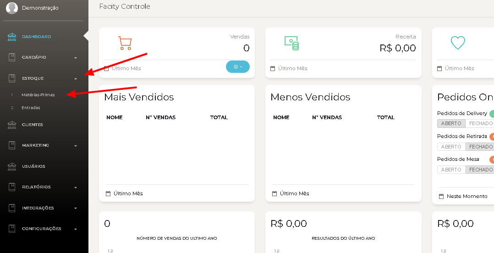
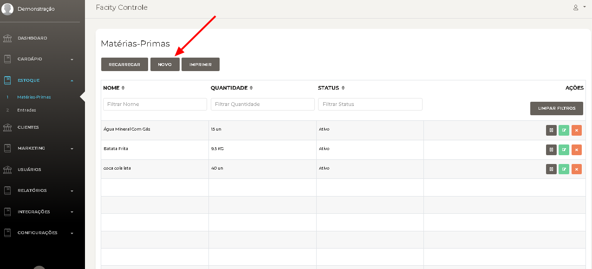
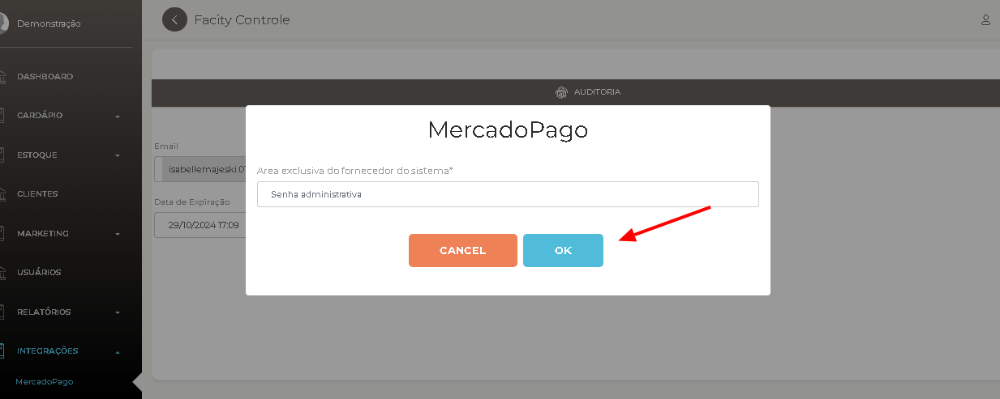
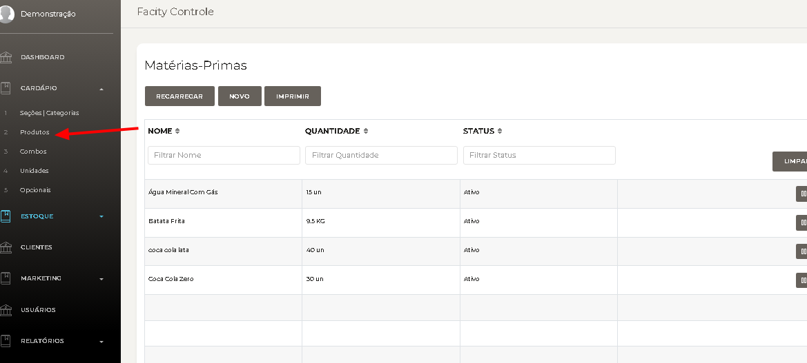
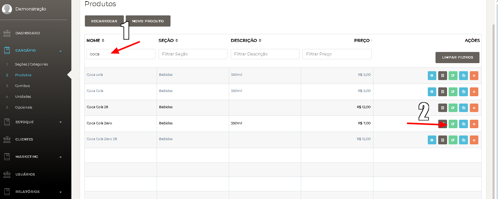
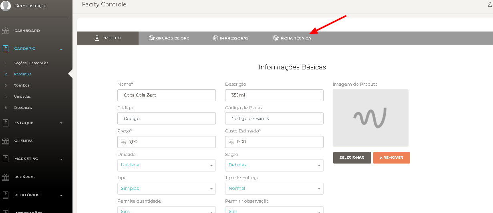
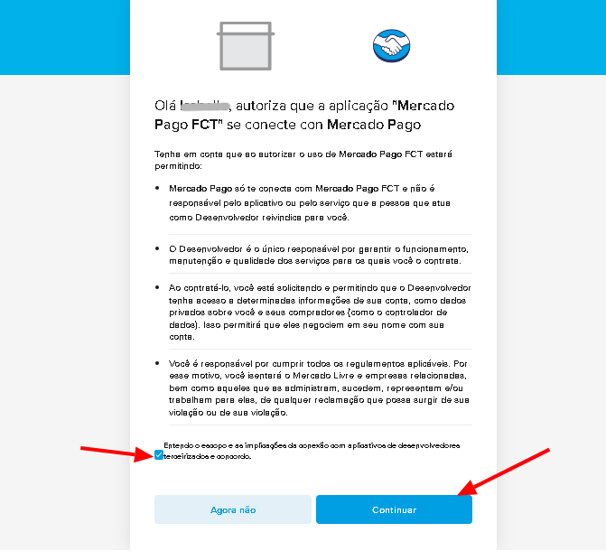
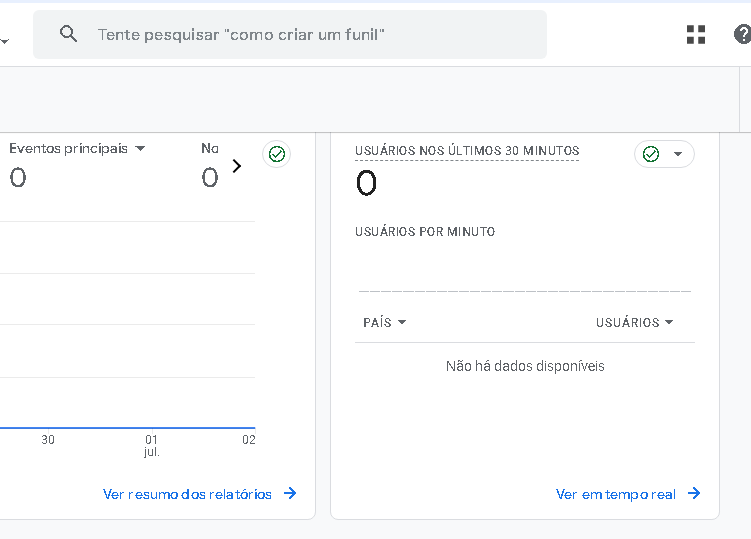
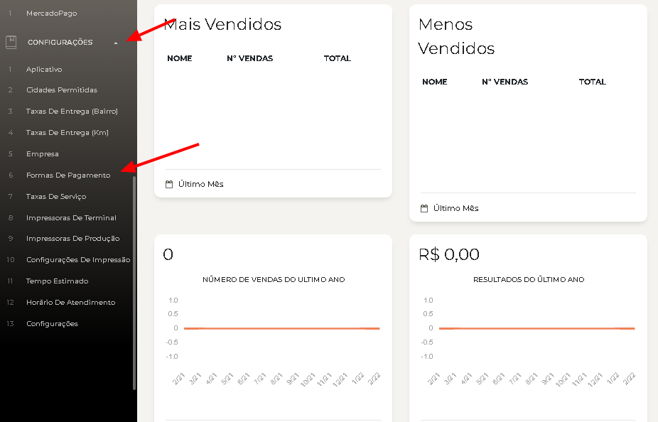
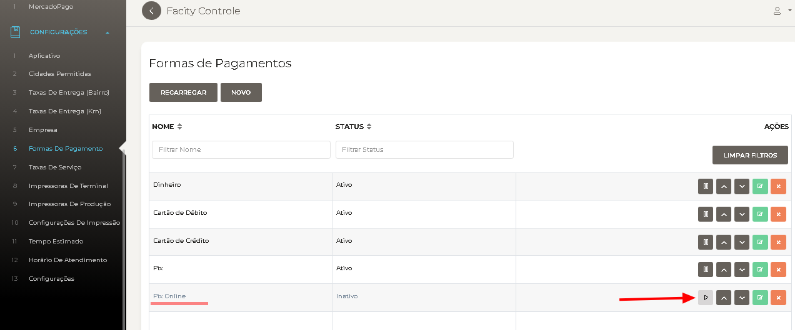

Integrar o **Mercado Pago** ao sistema **Facity** é simples e rápido, seguindo estes passos:

**Passo 1:** Abra o **Facity Controle** no seu computador e insira o nome da **empresa**, **login** e **senha**, utilizando letras minúsculas.

**Passo 2:** No menu lateral à esquerda, clique em **“Integrações”** e depois em **“Mercado Pago”.**

Passo 3: Clique em **"Renovar"**. Caso seja solicitada uma senha, entre em contato com o **Suporte Facity** para obtê-la e continuar com a integração de forma tranquila.

**Passo 4:** Se você já possui uma conta no **Mercado Pago**, insira o **email** da sua conta e clique em **“Ok”** para prosseguir. Se não possui uma conta, siga o **link** fornecido para criar uma conta no **Mercado Pago.**

[👉 https://blog.facity.com.br/como-criar-uma-conta-no-mercado-pago/](http://👉 https://blog.facity.com.br/como-criar-uma-conta-no-mercado-pago/)

**Passo 5:** Clique em **“Autorizar”** para prosseguir com a integração.

**Passo 6:** Após clicar em autorizar, uma nova página será aberta no seu navegador. Siga as etapas para entrar na sua conta do **Mercado Pago**:

- Coloque seu E-mail;
- Coloque sua senha;
- Clique em **"Iniciar sessão"**

**Passo 7:** Clique na caixa que aparece no final do texto e depois em **"continuar"**.

**Passo 8:** Selecione **“Autorizar este aplicativo”**.

**Passo 9:** Após autorizar, uma tela de confirmação irá aparecer, concluindo a **integração**.

**Passo 10:** Para ativar essa forma de pagamento:

- Volte para o **Facity Controle;**
- Clique em **configurações**;
- Selecione **Forma de pagamento**;

**Passo 11:** Após realizar a integração, a opção **"Pix Online"** estará disponível. Para ativá-la, clique em **"Ativar".**

Com este simples e objetivo passo a passo, você pode integrar facilmente o **Mercado Pago** ao seu sistema **Facity**.
