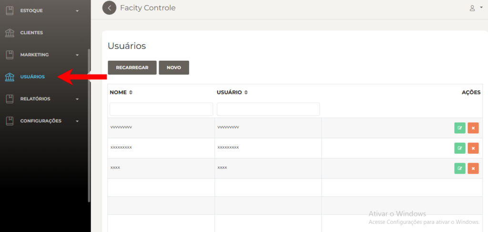
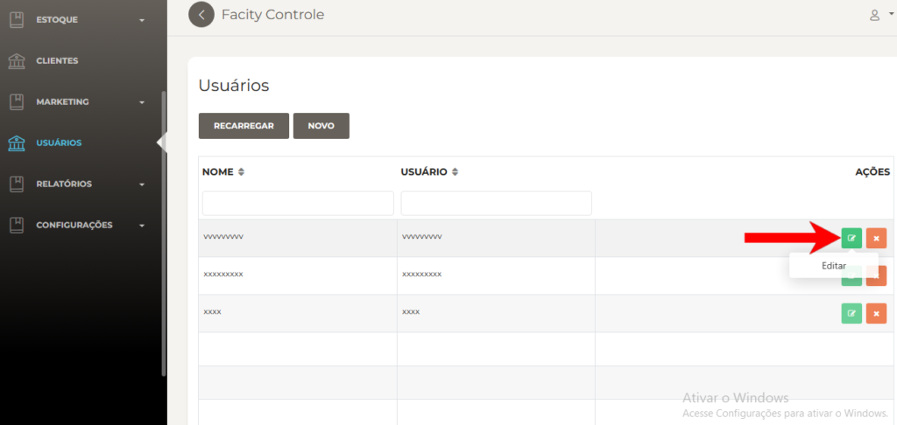
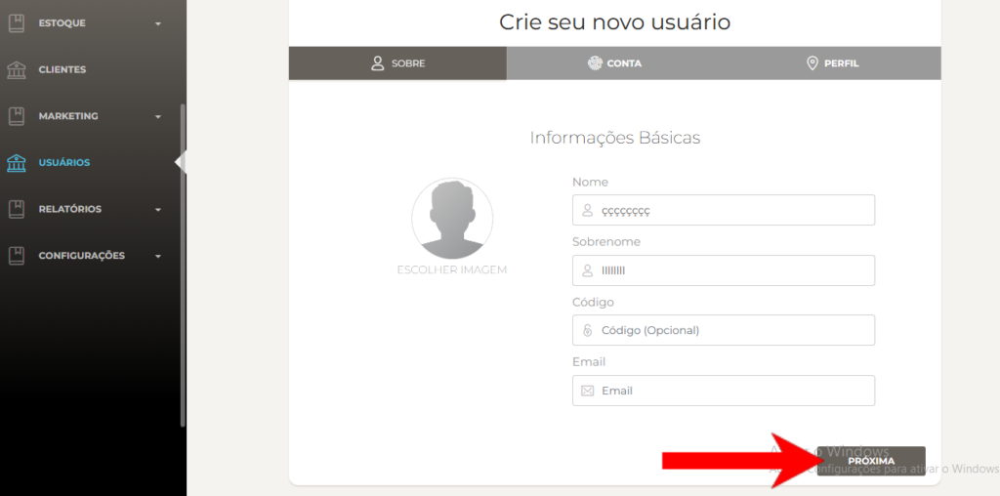
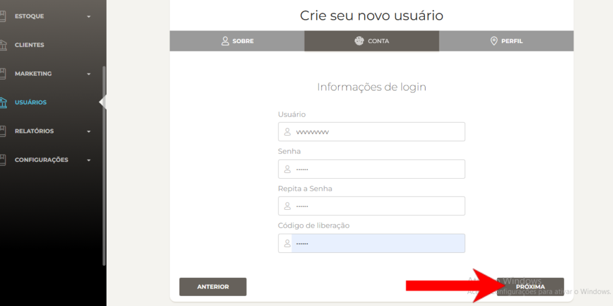
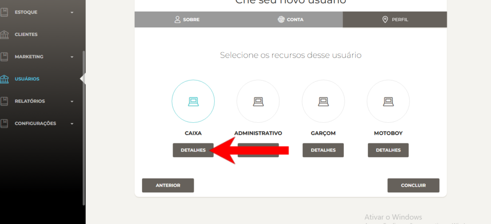
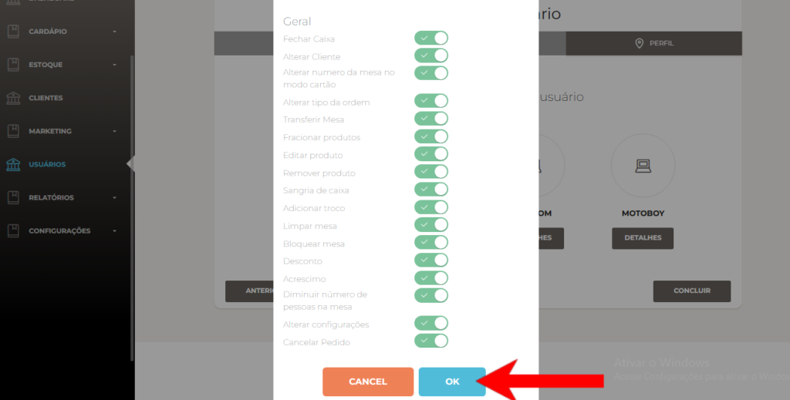

Passo a passo sobre como limitar permissões dos usuários no sistema:

**Passo 1:** Abra o Facity Controle em seu computador

Digite o nome da **empresa**, **login** e **senha**, lembrando que tudo deve ser em _**letras minúsculas.**_

**Passo 2:** Abra o menu

No menu, clique em **"cardápio"** e, em seguida, clique em **"usuários"**.

**Passo 3:** Escolha o **usuário** que deseja alterar as permissões e clique no **ícone verde** para editar

**Passo 4:** Depois que clicar em "**Editar"**, clique em **"Próxima"** até chegar na ultima opção.

Segue um exemplo nas imagens abaixo:

**Passo 5:** Escolha a função e clique em **"detalhes"**.

Selecione a função que deseja limitar as permissões.

**Passo 6:** Desmarque as permissões que deseja limitar.

Visualize as permissões atuais do usuário e desmarque as que deseja limitar. Por exemplo, se não quiser que o usuário acesse uma função do sistema específica, desmarque a opção correspondente.

**Passo 6:** Salve as alterações. Clique em **"OK"** para salvar as alterações e limitar as permissões do usuário.

Pronto! Agora você sabe como limitar as permissões dos usuários em um sistema usando o **Facity Controle**. Seguindo esses passos, é possível garantir a segurança das informações da sua empresa.
