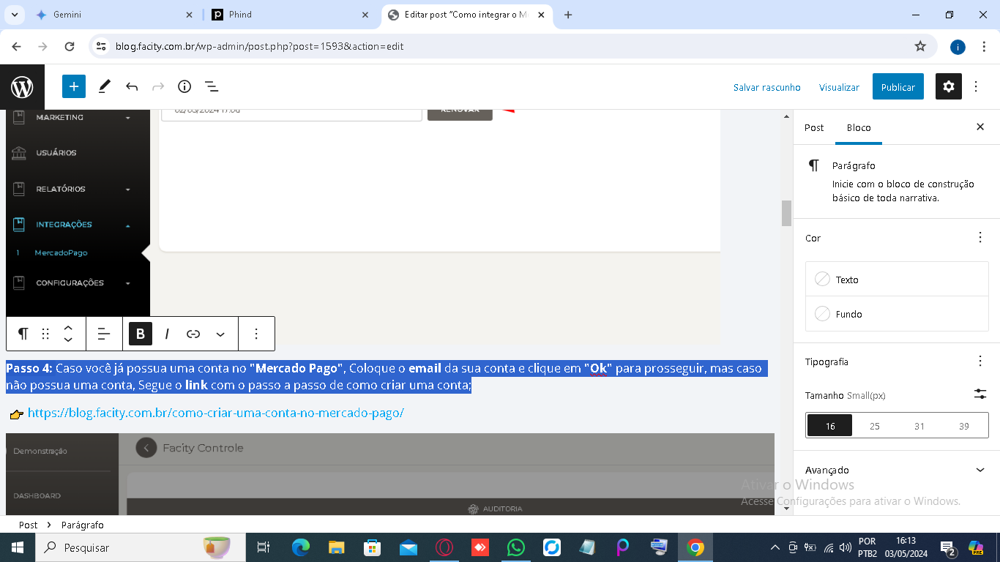
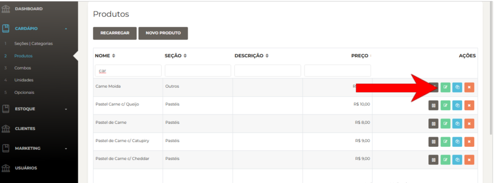
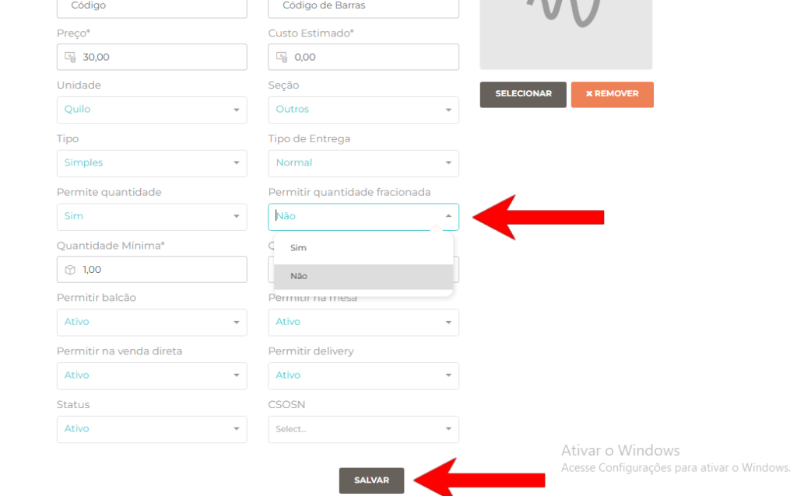

**Passo 1:** Abra o **Facity Controle** no seu computador e faça **login**.

**Passo 2:** Acesse **"Produtos"** no menu principal.

**Passo 3:** Selecione o produto desejado e clique no ícone verde para editá-lo.

**Passo 4:** Marque a opção **"Permitir quantidade fracionada"** na página de edição e depois clique em **"salvar"**.

Agora você pode vender e gerenciar quantidades fracionadas desse produto de forma simples. Se tiver mais produtos, repita o processo.
