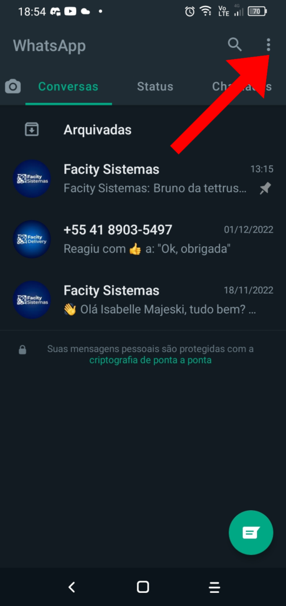
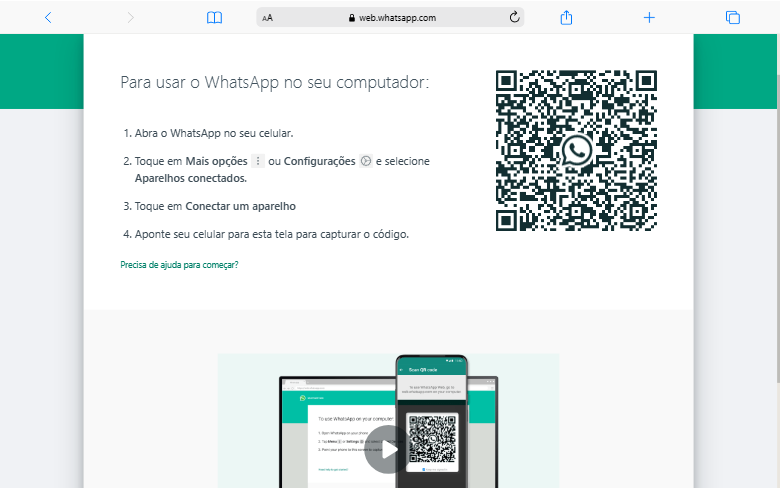

Se você utiliza o WhatsApp Web para conversar com seus contatos pelo computador, provavelmente já se deparou com o problema de sincronismo entre as mensagens do celular e as do navegador. Mas não se preocupe, neste tutorial vou te ensinar como resolver esse problema de forma simples e objetiva.

**Passo 1**: Abra o WhatsApp no seu celular e clique nos três pontos localizados no canto superior direito da tela.

**Passo 2**: Em seguida, selecione a opção **"Aparelhos Conectados".**

**Passo 3:** Desconecte todos os aparelhos conectados ao WhatsApp clicando em cima de cada um e selecionando a opção **"Desconectar".**

**Passo 4:** Agora, abra o WhatsApp Web no seu navegador e conecte seu celular novamente.

**Passo 5:** Repita esse processo sempre que o problema de sincronismo entre as mensagens do celular e do navegador acontecer.

É importante lembrar que esse problema é um bug do próprio **WhatsApp** e que ele pode conectar até 4 dispositivos. Por isso, sempre que precisar, siga esses passos simples para resolver o problema de sincronismo.
