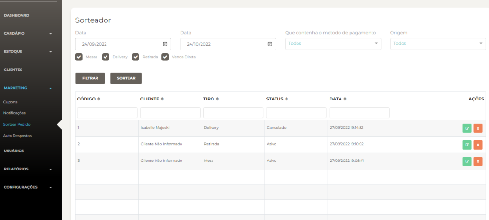
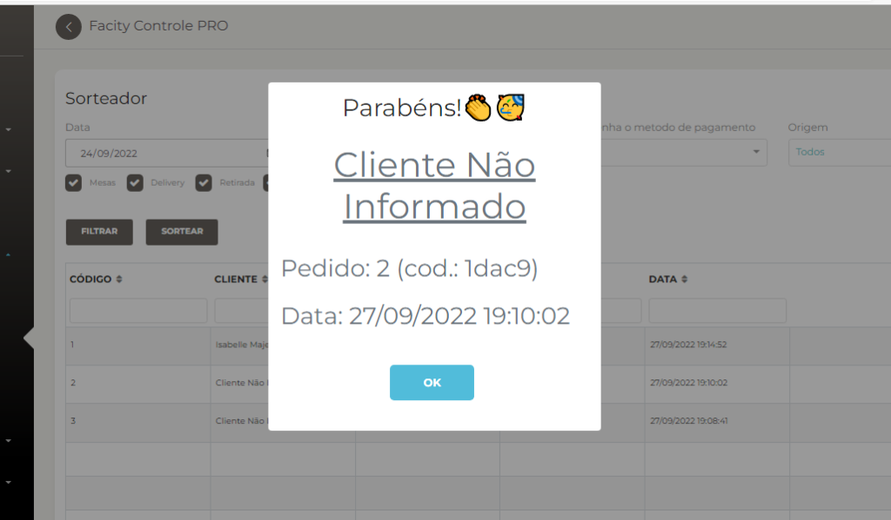

**Passo 1:** Acesse o **Facity Controle**

Abra o **Facity Controle** em seu computador e insira o **nome da empresa**, **login** e **senha**. Certifique-se de que tudo esteja em _letras minúsculas_.

**Passo 2:** Acesse o menu de **marketing**

Uma vez logado no **Facity Controle**, clique em **marketing** no menu lateral esquerdo.

**Passo 3:** Acesse a página de pedidos

No menu lateral esquerdo, clique em **"PEDIDOS"** para acessar a página de pedidos.

- Selecione a **data de início** e a **data final**
- Para quais **métodos de pagamentos** o sorteio vai valer
- _**Origem**_ (**App**, **POS** ou **todos**)
- Você pode **filtrar** quais clientes vão poder estar no sorteio marcando e desmarcando as opções (**mesas**, **delivery**, **retirada**, **venda direta**)

**Passo 4:** Acesse a opção de sorteio

Na página de detalhes do pedido, clique na opção **"SORTEAR"** localizada no canto inferior direito.

**Passo 5:** Realize o sorteio

Ao clicar em **"SORTEAR"**, o sistema irá sortear automaticamente um número entre 1 e o número de itens no pedido. O item correspondente ao número sorteado será o vencedor do sorteio.

**Passo 6:** Informe o cliente sobre o resultado

Depois de realizar o sorteio, informe o cliente vencedor sobre o resultado. Você pode fazer isso entrando em contato diretamente com ele ou enviando uma mensagem pelo aplicativo **Facity**.
