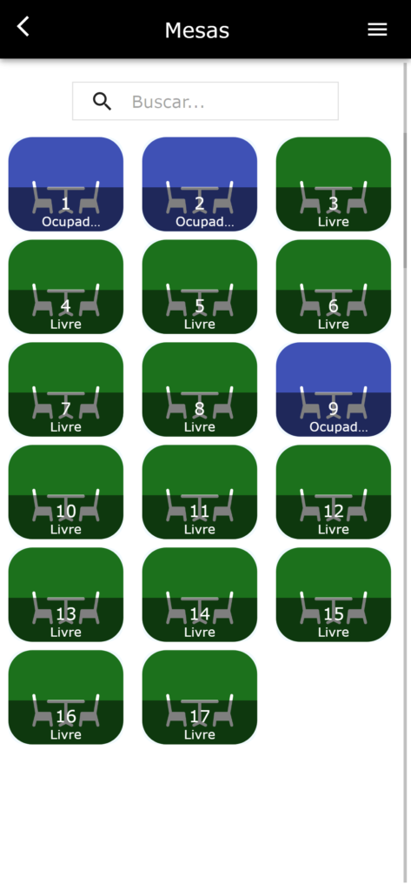
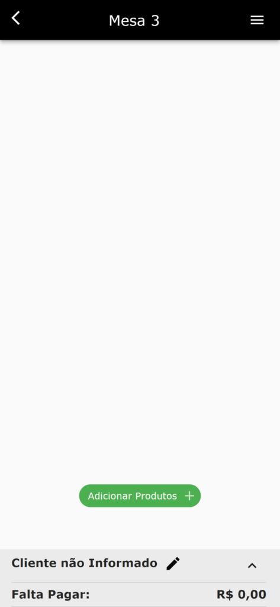
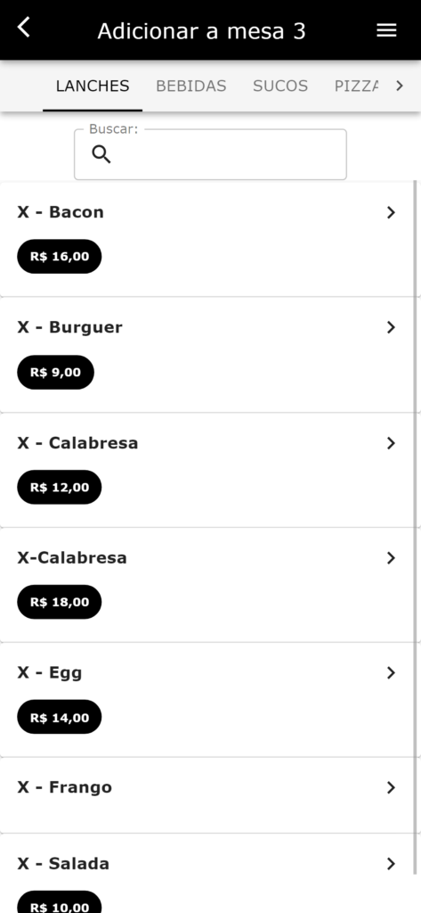
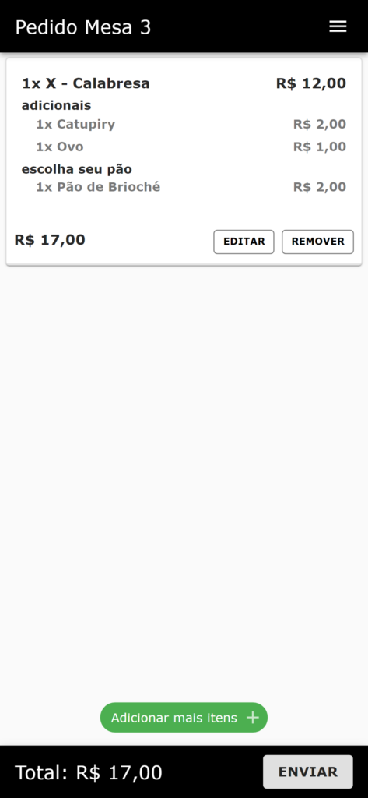
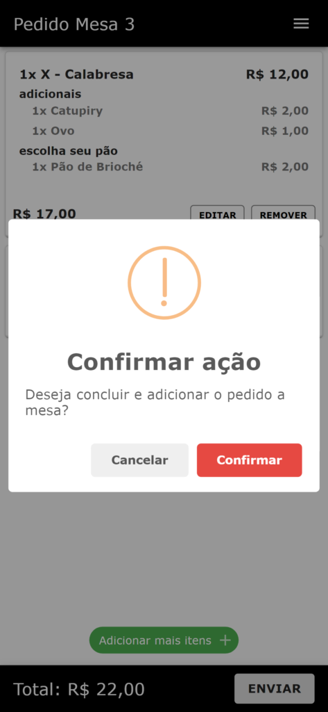
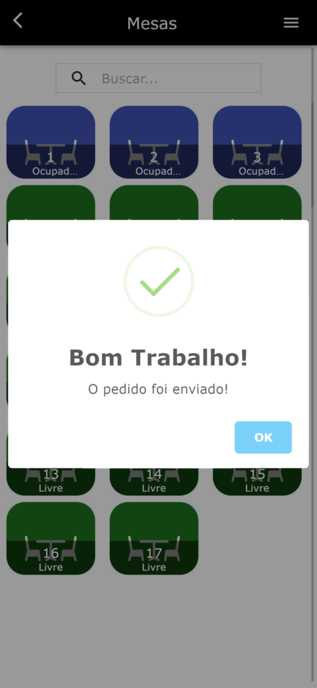

Neste post, vamos ensinar como utilizar o app **Facity Garçom** para gerenciar pedidos de forma simples e prática. Siga os seguintes passos:

**Passo 1:** Abra o aplicativo **Facity Garçom** no seu celular.

**Passo 2:** Insira o nome da empresa, login e senha, tudo em letras minúsculas.

**Passo 3:** Clique em cima de uma mesa livre para começar a anotar o pedido.

**Passo 4:** Clique em **"Adicionar Produtos"**.

**Passo 5:** Selecione os produtos desejados clicando em cima deles ou buscando na barra de pesquisa.

**Passo 6:** Se quiser incluir mais produtos, clique em **"Adicionar mais itens".**

**Passo 7:** Clique em **"Enviar"** para finalizar o pedido.

**Passo 8:** Confirme essa ação ou cancele se quiser editar algum item da lista.

**Passo 9:** Após confirmar a ação, o seu pedido será enviado.

Com esses passos, você já pode usar o app dos garçons da **Facity** de maneira simples e prática.
