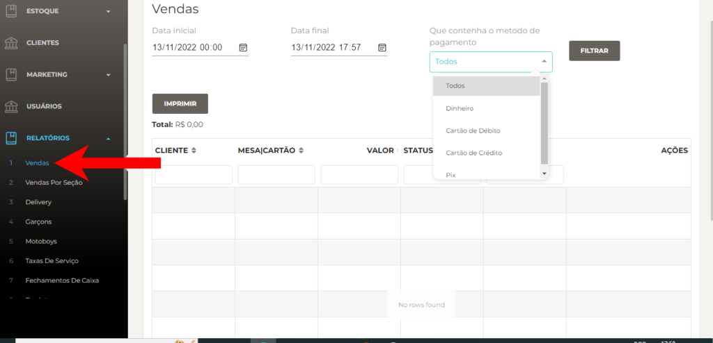
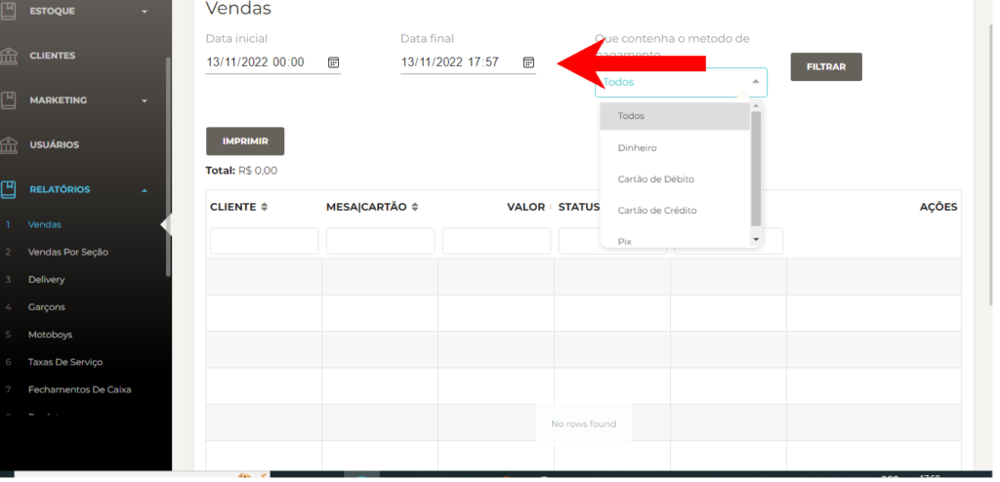

Neste post, vamos explicar passo a passo como gerar um relatório de vendas.

**Passo 1:** Abra o **Facity Controle** em seu computador

Para começar, abra o **Facity Controle** em seu computador. Certifique-se de que tem o **login** e **senha corretos da sua empresa**. Lembre-se de que tudo tem que ser digitado em _letras minúsculas._

**Passo 2:** Clique em **"Relatórios"**

No menu lateral à esquerda, clique em **"Relatórios"**.

**Passo 3:** Clique em **"Vendas"**

Dentro de **"Relatórios"**, clique em **"Vendas"**.

**Passo 4:** Filtre as vendas por **data** e **método de pagamento**

Na tela de **"Relatório de Vendas"**, você pode filtrar as vendas por data e método de pagamento. Escolha a data inicial e a data final que deseja filtrar. Lembre-se de que só pode ser filtrado um período de 30 dias entre cada uma. Em seguida, escolha o método de pagamento que deseja filtrar.

**Passo 5:** Verifique o relatório de vendas

Depois de filtrar as vendas por data e método de pagamento, o relatório de vendas trará o total de todas as vendas que contêm aquele pagamento. Por exemplo, se você filtrar por PIX, ele vai trazer todas as vendas que possuem PIX. No entanto, pode ser que na mesma venda tenha o valor do PIX e dinheiro. Nesse caso, o valor mostrado será o total de vendas e não apenas o valor de pagamento PIX. Caso você queira ver o total pela forma de pagamento, o ideal é usar o relatório de formas de pagamento.

_Clique nesse **link** abaixo para ver post de como gerar relatórios de formas de pagamento:_

[Como gerar relatórios de formas de pagamento?](https://blog.facity.com.br/?p=947) ???
