Guia de passo a passo para fazer um novo pedido de mesa no **Facity POS:**

**Passo 1:** Abra o **Facity POS** no seu computador.

Ao abrir o aplicativo, insira o **nome da empresa**, **login** e **senha em letras minúsculas.**

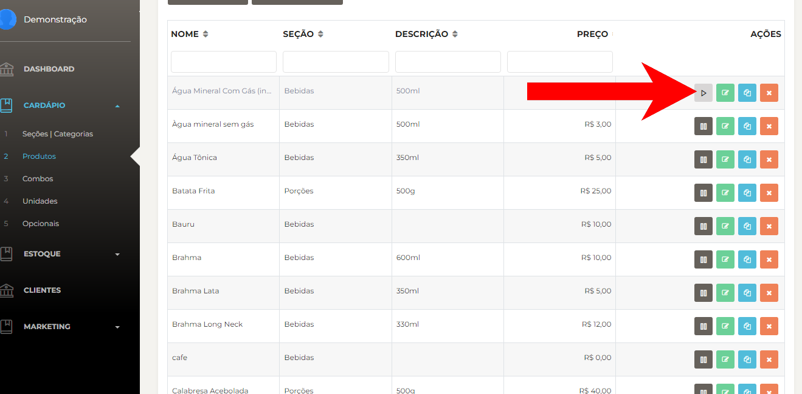

**Passo 2:** Escolha o terminal de impressão. Selecione o terminal de impressão preferido e faça outras alterações de configuração, se desejar.

_Essa parte da configuração aparece uma vez que abrir o sistema no computador ou quando mudar de uma empresa pra outra_.

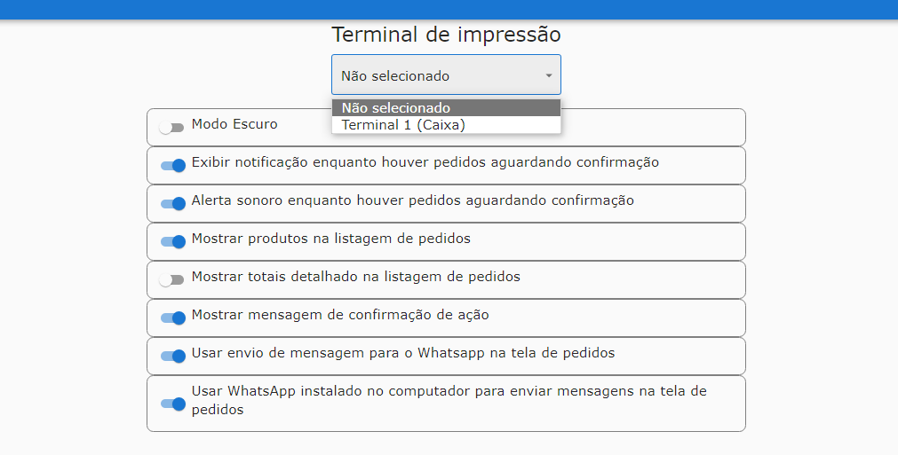

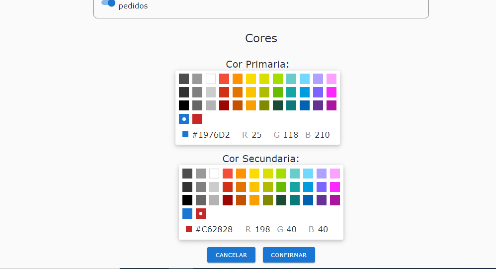

**Passo 3:** Adicione um fundo de troco e abra o caixa. Para começar a receber pagamentos, adicione um fundo de troco e abra o caixa.

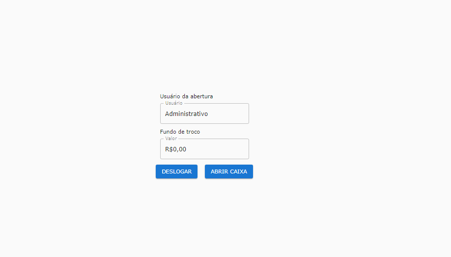

**Passo 4:** Adicione uma mesa para o novo pedido. Crie uma nova mesa para o pedido que será realizado.

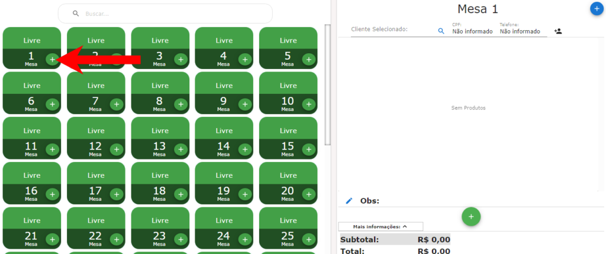

**Passo 5:** Adicione os produtos ao pedido.

Escolha os produtos desejados, procurando pelo nome ou pela seção em que estão.

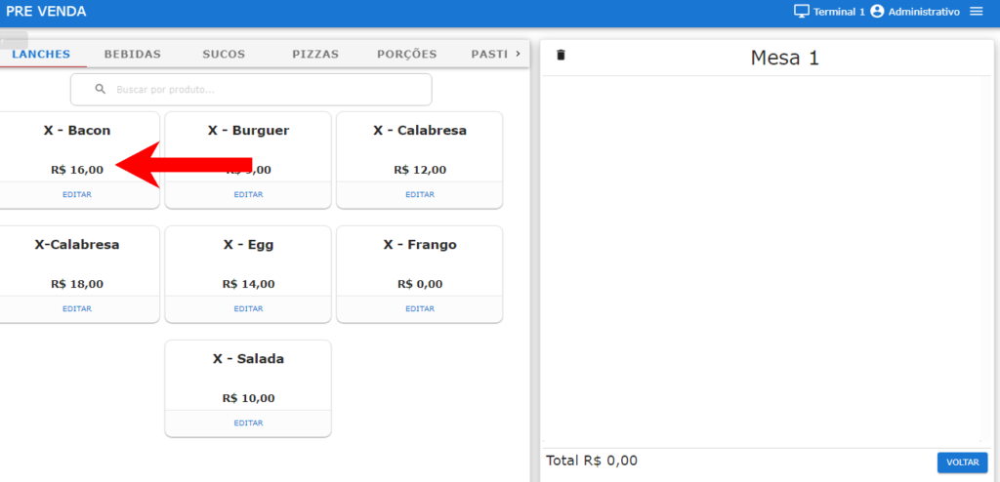

**Passo 6:** Adicione os opcionais dos produtos, se necessário.

Para produtos que têm opções adicionais, escolha as opções desejadas.

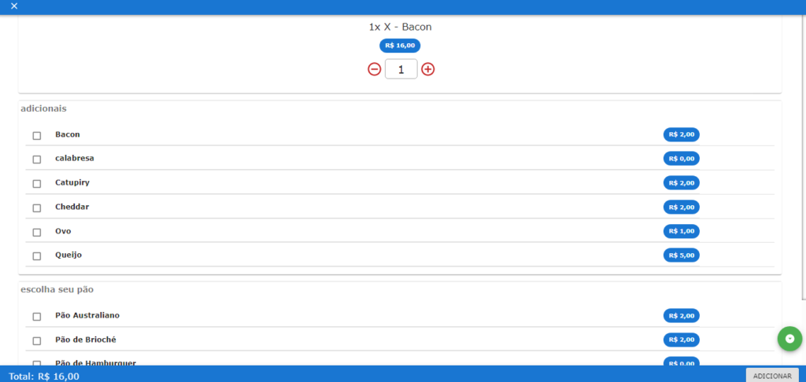

**Passo 7:** Adicione o pedido à mesa. Ao clicar em **"Adicionar"**, uma mensagem será exibida perguntando se deseja adicionar o pedido à mesa.

Clique em **"Sim"** para adicionar.

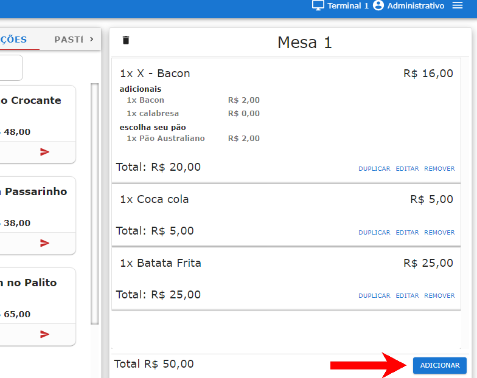

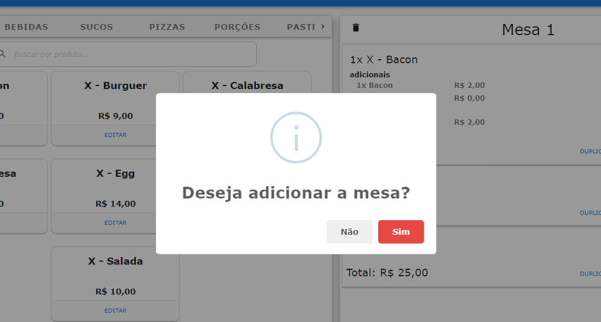

**Passo 8:** Para **finalizar o pedido** e cobrar o cliente clique em cima da mesa ocupada

<figure>

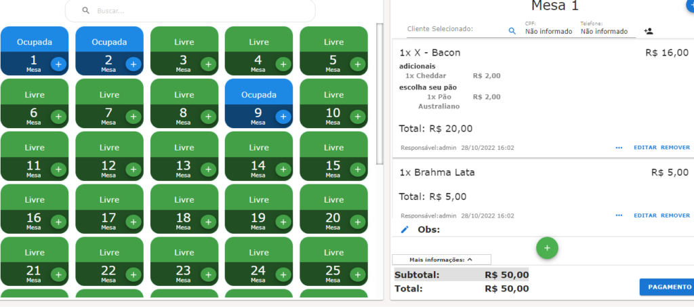

<figcaption>

</figcaption>

</figure>

**Passo 9:** Feche a mesa e finalize o pedido. Quando estiver pronto para finalizar o pedido, clique na mesa ocupada e selecione "Pagamento". Escolha a forma de pagamento, adicione-a e feche a mesa.

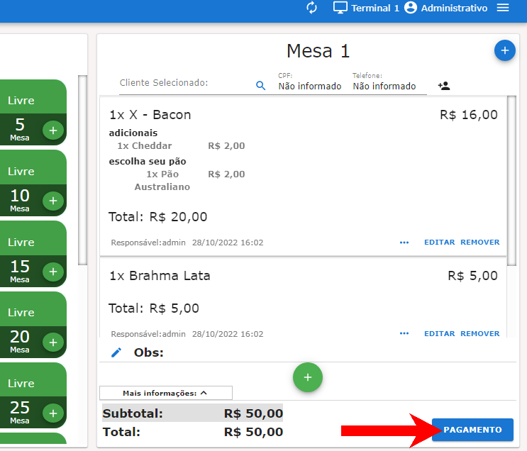

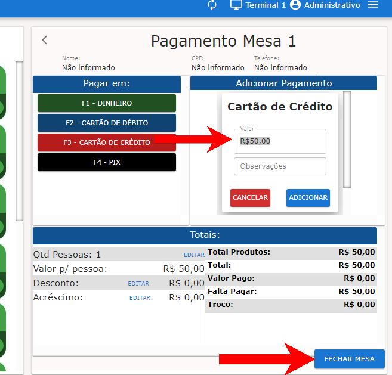

**Passo 10:** Confirme a finalização do pedido.

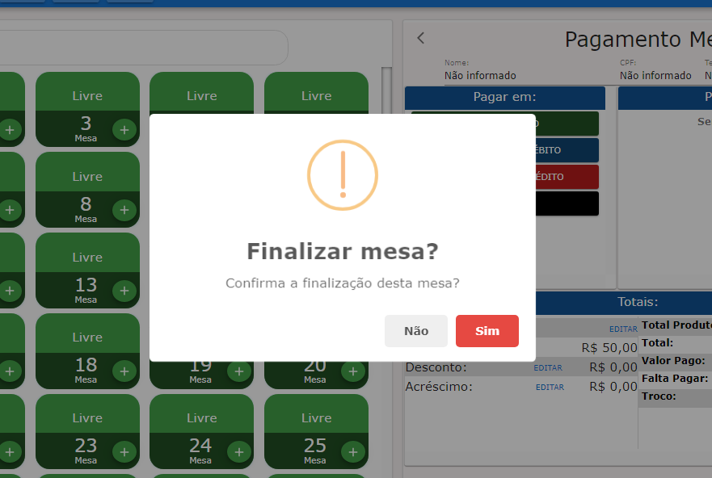

Certifique-se de que o pedido foi finalizado e de que o cliente foi cobrado corretamente.