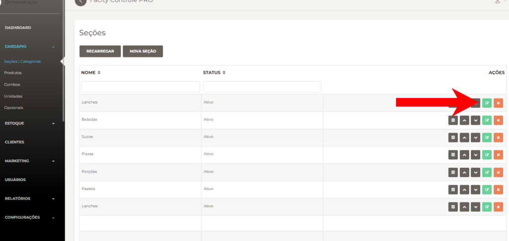
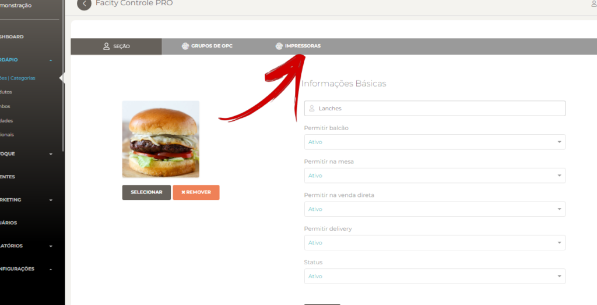
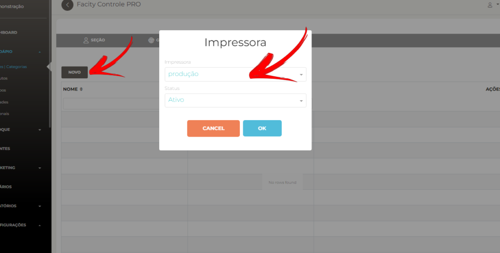

Neste post, vamos te mostrar um passo a passo simples e objetivo para vincular impressoras de produção na **seção/categoria** no **Facity Controle**. Vamos lá!

**Passo 1:** Abra o **Facity Controle** em seu computador

Para começar, abra o **Facity Controle** em seu computador e insira o **nome da empresa**, **login** e **senha**. É importante lembrar que tudo deve ser escrito em letras minúsculas.

**Passo 2:** Acesse o menu administrativo e clique em **"Cardápio"** e depois em **"Seção/categoria"**

No menu administrativo, clique em **"Cardápio"** e depois em **"Seção/categoria"**.

**Passo 3:** Selecione a seção que você quer vincular a impressora e clique no ícone verde para editar

Escolha a seção que você deseja vincular a impressora e clique no ícone verde para editar.

**Passo 4:** Busque por **"Impressoras"**

Na página de edição, busque por **"Impressoras"**.

**Passo 5:** Selecione **"NOVO"** e adicione a impressora de produção

Clique em **"NOVO"** e adicione a impressora de produção como mostra na imagem. Pronto! Agora sua impressora de produção está vinculada à **seção/categoria** selecionada.

**Passo 6:** Adicione uma impressora em um único **produto _(opcional)_**

Caso você queira adicionar uma impressora em um único produto, basta buscar o produto na lista e seguir as mesmas etapas acima.

Esperamos que esse passo a passo tenha te ajudado a vincular impressoras de produção na **seção/categoria** do **Facity Controle** de forma fácil e rápida. Se você tiver alguma dúvida ou sugestão, deixe um comentário abaixo. Até a próxima!
