Entendendo as variáveis disponíveis, as variáveis disponíveis são as seguintes:

1. **\[openinghours\]**: Essa variável permite exibir os horários de funcionamento do estabelecimento.
2. **\[deliverytime\]**: Utilize essa variável para mostrar o tempo estimado de entrega para pedidos de delivery, em horas.
3. **\[withdrawaltime\]**: Essa variável mostra o tempo estimado de retirada de pedidos, em horas.
4. **\[deliverytimeminutes\]**: Utilize essa variável para mostrar o tempo estimado de entrega para pedidos de delivery, em minutos.
5. **\[withdrawaltimeminutes\]**: Essa variável mostra o tempo estimado de retirada de pedidos, em minutos.
6. **\[companyaddress\]**: Utilize essa variável para exibir o endereço da empresa.
7. **\[webappurl\]**: Essa variável contém a URL do aplicativo.
8. **\[sendername\]**: Utilize essa variável para obter o nome informado pelo cliente através do WhatsApp.

Para usar as variáveis, segue um passo a passo:

**Passo 1:** Abra o **Facity Controle** em seu computador

Digite o **nome da empresa**, **login** e **senha**, lembrando que tudo deve ser em _letras minúsculas_.

**Passo 2:** Navegue até o menu **"Marketing"**

No painel do Facity Controle, encontre e clique na opção **"Marketing"**. Em seguida, dentro do menu **"Marketing"**, procure pela opção **"Auto Respostas"** e clique nela.

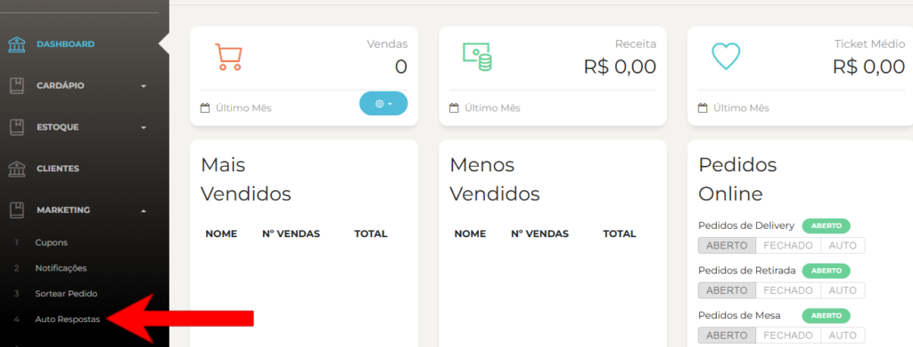

**Passo 3:** Adicione as novas variáveis às auto respostas

Agora vem a parte importante! Na tela das **"Auto Respostas"**, você verá um ícone em azul para adicionar novas respostas. Clique nesse ícone para começar a criar as suas auto respostas e incluir as novas variáveis.

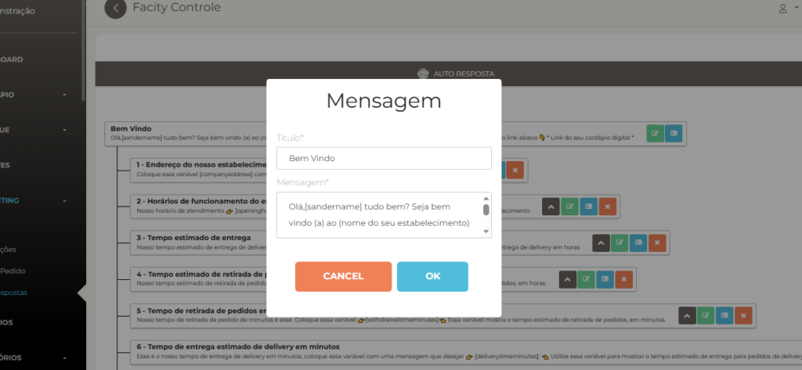

**Passo 4:** Exemplo de como colocar as variáveis

Todas as variáveis estão no inicio do post ☝

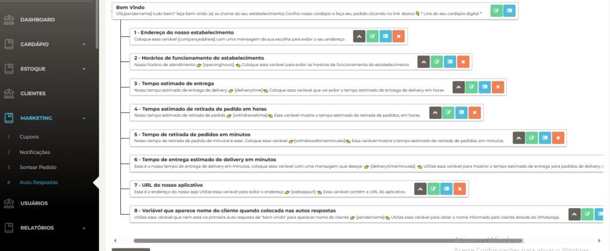

**Alguns exemplos de variáveis:**

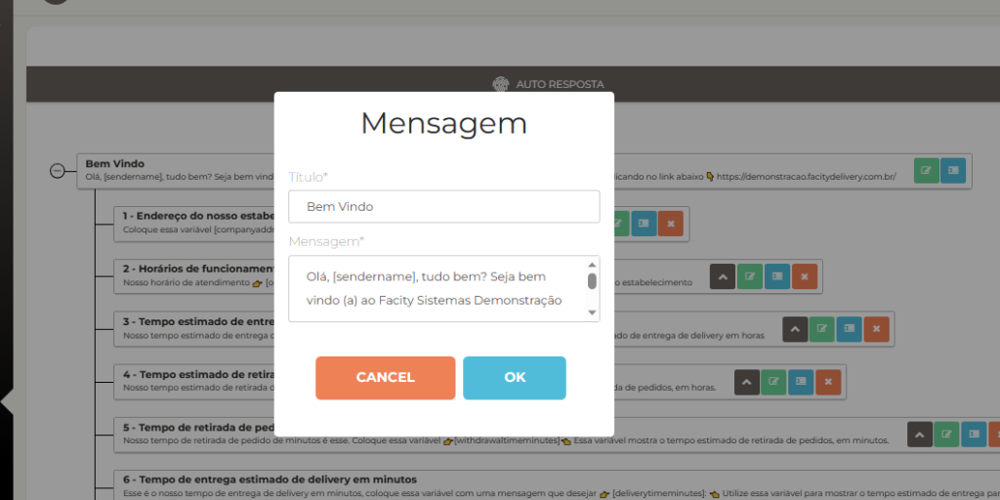

1.**\[companyaddress\]**: Utilize essa variável para exibir o endereço da empresa.

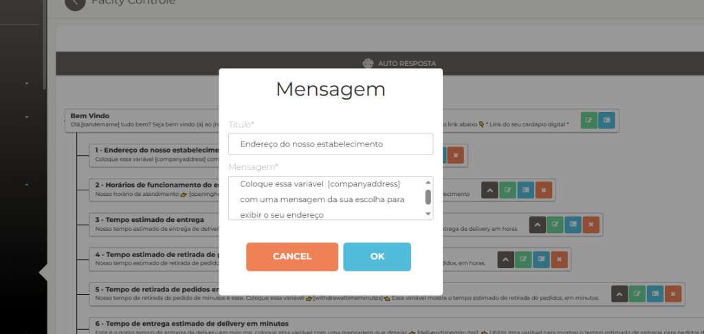

2\. **\[openinghours\]**: Essa variável permite exibir os horários de funcionamento do estabelecimento.

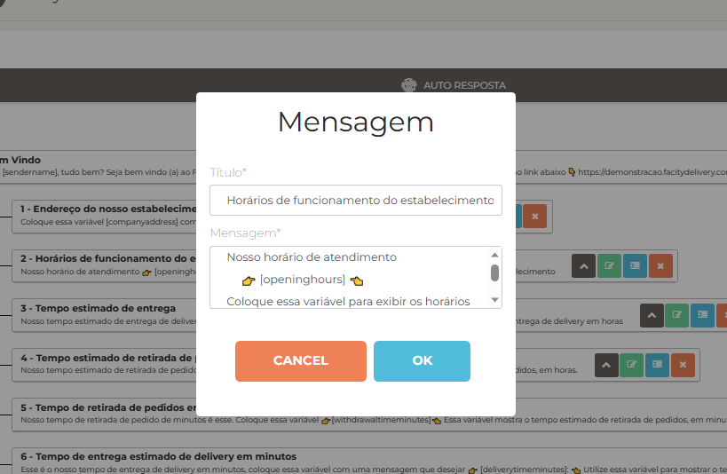

3\. **\[deliverytime\]**: Utilize essa variável para mostrar o tempo estimado de entrega para pedidos de delivery, em horas.

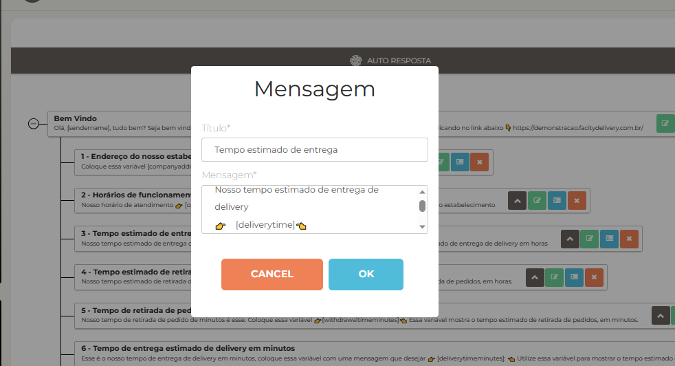

4\. **\[withdrawaltimeminutes\]**: Essa variável mostra o tempo estimado de retirada de pedidos, em minutos.

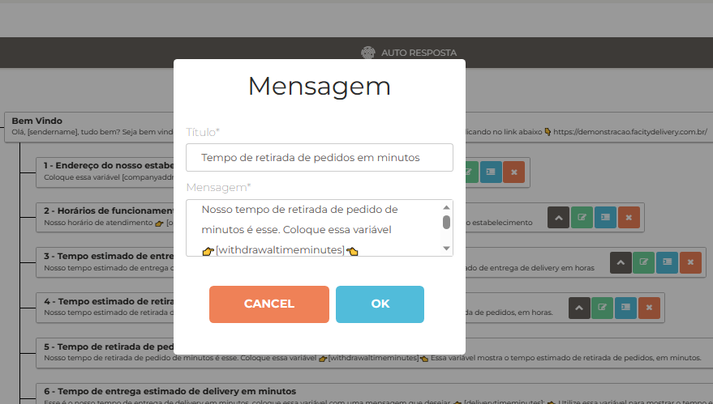

5\. **\[deliverytimeminutes\]**: Utilize essa variável para mostrar o tempo estimado de entrega para pedidos de delivery, em minutos.

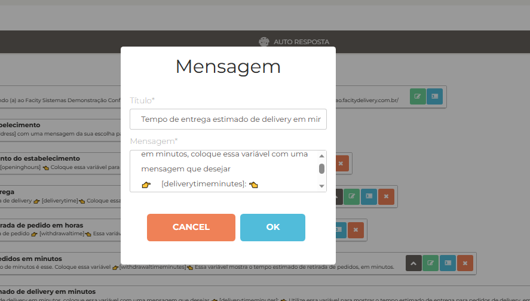

6\. **\[webappurl\]**: Essa variável contém a URL do aplicativo.

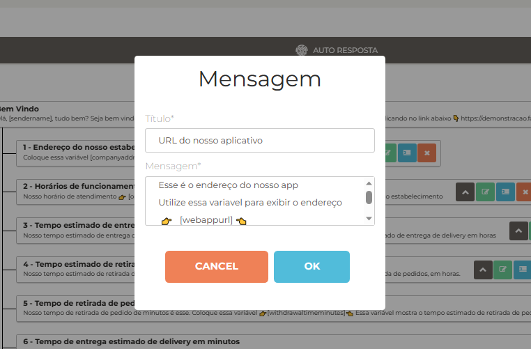

7\. **\[sendername\]**: Utilize essa variável para obter o nome informado pelo cliente através do WhatsApp.

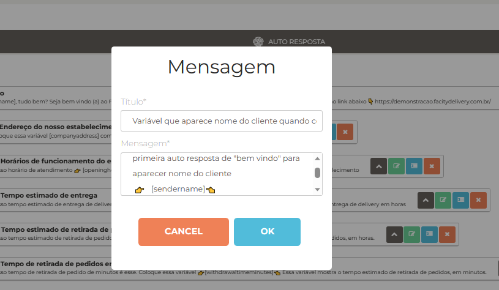

**Passo 5:** Não se esqueça de salvar

Após criar todas as suas auto respostas com as variáveis desejadas, clique em **"SALVAR"** para garantir que todo o trabalho feito seja armazenado corretamente e não se perca.

Agora você está pronto para utilizar as novas variáveis em seu bot e fornecer informações atualizadas de forma simples e eficiente. Aproveite esses recursos para tornar a experiência dos seus clientes ainda melhor!

Esperamos que este passo a passo tenha sido útil para você. Se tiver alguma dúvida ou quiser compartilhar suas experiências, deixe um comentário abaixo. Até a próxima!
